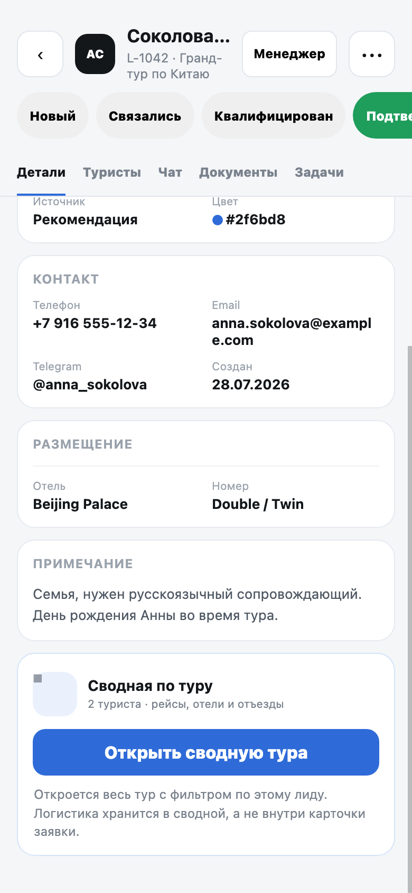
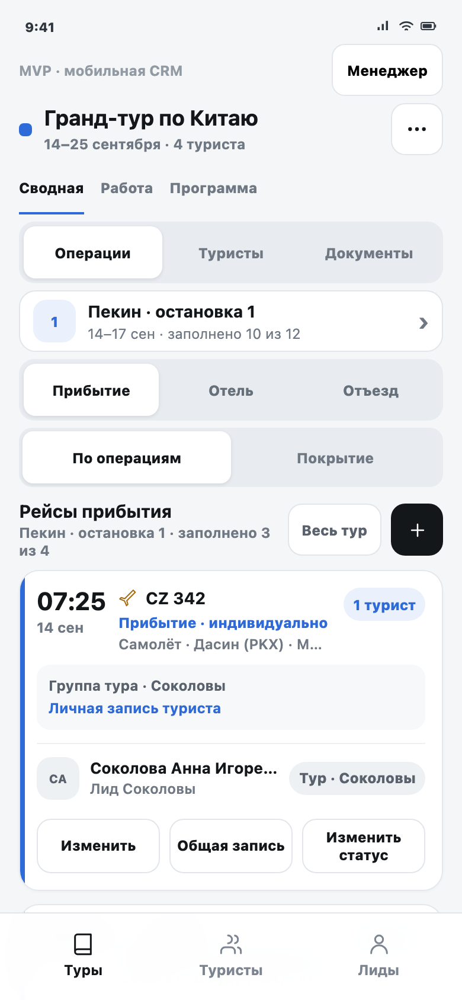
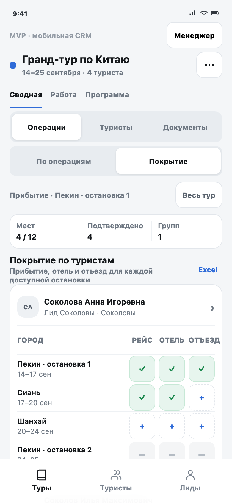
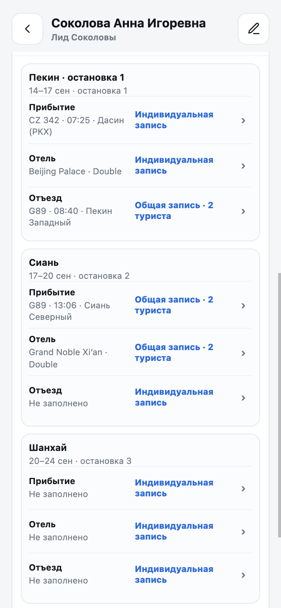
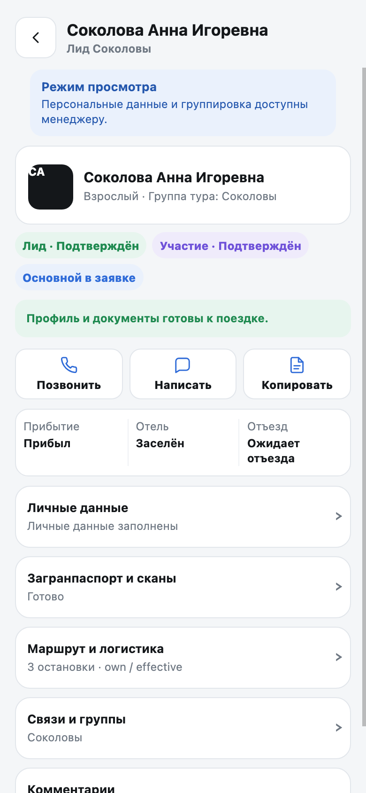
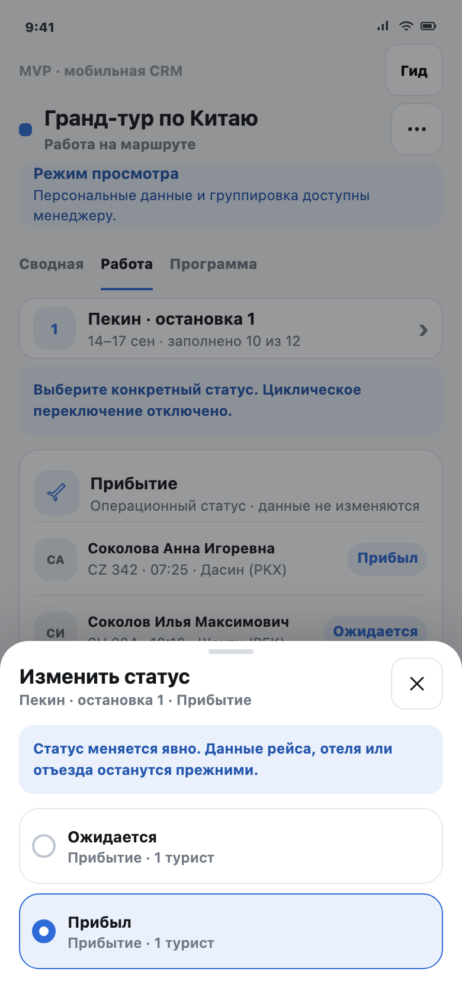
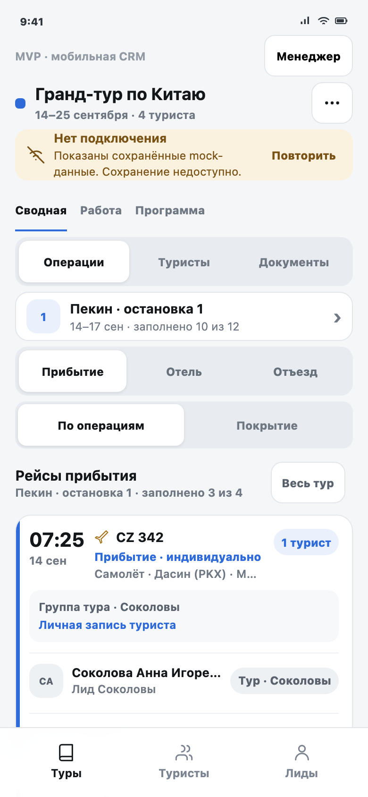
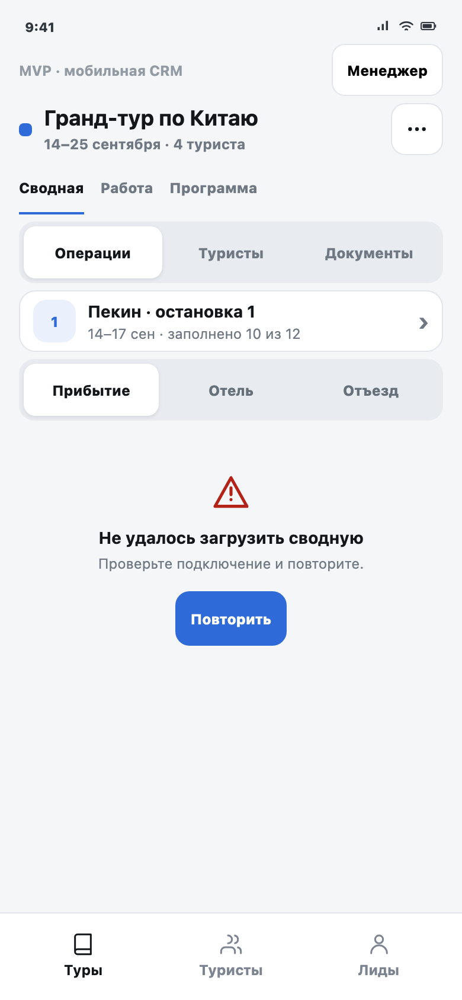
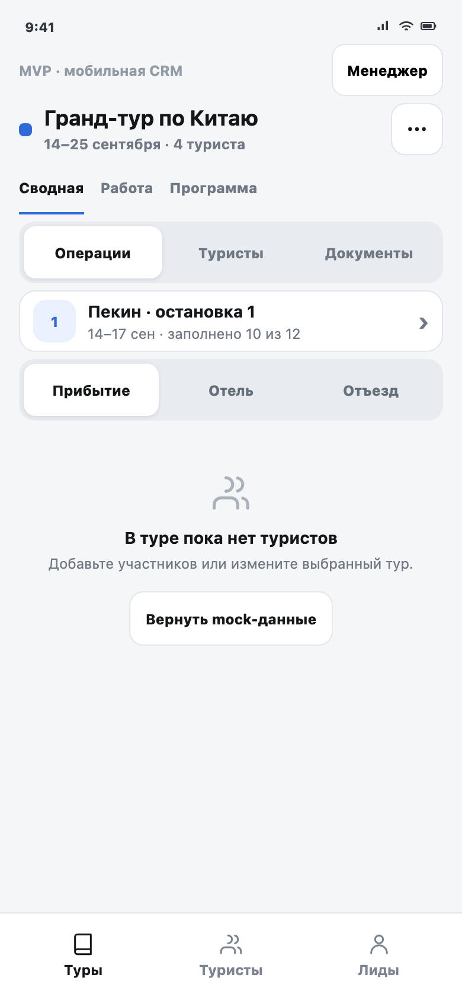
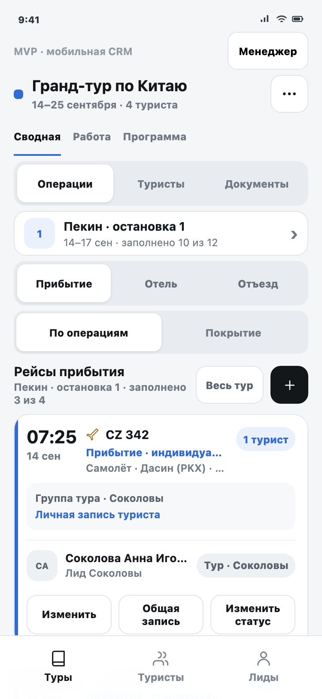

# ТЗ: единая мобильная сводная и карточка туриста

Этап продукта: MVP

Статус: MVP-прототип к проверке

Дата обновления: 4 августа 2026 года

Канонический документ: `mobile-leads-tz.md`

HTML-страница на GitHub Pages должна передавать те же требования и критерии. Прежнее ТЗ приложения гида не изменяется.

## Как читать это ТЗ

Документ состоит из двух частей:

1. Визуальный сценарий объясняет, как менеджер, администратор, сопровождающий и гид работают с мобильной CRM.
2. Полный каталог требований ниже фиксирует проверяемое поведение, ограничения и следующий этап.

Текущая разработка — **MVP кликабельного прототипа**. Она проверяет мобильный способ работы с теми же туристами, остановками маршрута и логистическими записями, которые в веб-версии находятся в «Сводной таблице». Production API, база и рабочее мобильное приложение на этом этапе не меняются.

### Карта продукта

```text
Лид или тур
      ↓
Остановка маршрута · routeCityId
      ↓
Прибытие | Отель | Отъезд
      ↓
Индивидуальная или общая запись
```

«Лиды» и «Туры» остаются разными пунктами меню:

- в «Лидах» менеджер работает с заявкой, контактом, сообщениями, документами и задачами;
- в «Турах» менеджер работает со всем составом, маршрутом, логистикой и фактическими статусами;
- из карточки лида можно открыть тот же тур с областью «Этот лид», не создавая копию данных.

#### Как читается одна и та же информация

| Веб-«Сводная таблица» | Мобильная сводная |
|---|---|
| Строка — турист | Сначала выбирается тур или турист |
| Группа колонок — позиция города | Затем выбирается остановка маршрута |
| Ячейка — прибытие, отель или отъезд | На экране открывается одна из трёх операций |
| Вся матрица видна одновременно | Общую картину показывает режим «Покрытие» |

Это разные представления одних данных. Мобильный интерфейс не создаёт копию веб-сводной и не меняет модель хранения.

### Основной путь менеджера

| Шаг | Пользователь делает | Система сохраняет |
|---|---|---|
| 1 | Открывает лид и проверяет состав | Связь заявки с каноническими туристами |
| 2 | Нажимает «Открыть сводную тура» | Тур, область «Этот лид» и контекст возврата |
| 3 | Выбирает остановку маршрута | Точный `routeCityId`, включая повторный город |
| 4 | Заполняет прибытие, отель и отъезд | Три независимые операции и их источники |
| 5 | Открывает «Покрытие» | Режим ничего не меняет, только показывает пробелы |



На карточке лида блок «Сводная по туру» объясняет, что логистика хранится на уровне тура. Кнопка открывает весь связанный тур с фильтром по участникам текущего лида.



На основном экране одновременно видны выбранная остановка маршрута, одна из трёх операций, область «Этот лид / Весь тур» и тип каждой записи. Это мобильный эквивалент работы с выбранной ячейкой веб-таблицы.

### Два режима сводной

- **«По операциям»** нужен для заполнения и изменения конкретного рейса, отеля или отъезда.
- **«Покрытие»** показывает по каждому туристу и каждой доступной остановке, какие из трёх операций уже заполнены.



Покрытие сохраняет смысл широкой веб-таблицы, но помещает данные одного туриста в вертикальную карточку. Незаполненная ячейка открывает форму нужного города и операции.

### Два независимых уровня группировки

```text
Анна        Илья        Марина       Денис
  └──────── одна группа туристов на весь тур ────────┘

Отель       └────────── общая запись на 4 ──────────┘
Прибытие    └── рейс A · 2 ──┘ └── рейс B · 2 ─────┘
Отъезд      личный      личный      личный      личный
```

- `groupId` отвечает за состав группы туристов на уровне тура;
- `subgroupId` отвечает только за одну операцию в одной позиции маршрута;
- отделение от прибытия не меняет отель, отъезд или группу тура;
- объединение не копирует данные источника в индивидуальные записи участников.


Свободного туриста можно добавить в одну существующую группу. Две существующие группы не сливаются автоматически: сначала одну из них нужно разъединить.


Если выбранные туристы имеют разные данные, система останавливает применение. Менеджер сравнивает поля и явно выбирает основную запись. До этого момента ничего не меняется; индивидуальные данные остальных туристов сохраняются.


Разъединение выполняется в составе конкретной общей записи. Менеджер видит операцию, позицию маршрута, источник и участников, выбирает отделяемых туристов и подтверждает действие. Их личные данные снова становятся видимыми; общий отель, другие прибытия, отъезды и группа тура не изменяются.

### Единая карточка туриста

```text
ownValues + sourceVisitId → effectiveValues
личное       источник        отображается в сводной
```

Из лида, списка туристов, документов и операции открывается одна карточка по стабильному `touristId`. В ней собраны профиль, паспорта, сканы и OCR, маршрут, логистика, связи, группы и комментарии.



Для каждого города рядом показаны данные операции и её источник. Изменение личной записи меняет только `ownValues`. Если турист находится в общей записи, сводная продолжает показывать выбранный источник до разъединения.

### Роли и справочник

| Роль | Основная работа в MVP |
|---|---|
| Администратор | Все действия, удаление, управление турами и справочником |
| Менеджер | Профиль и документы назначенных лидов; логистика и группы всего доступного тура |
| Сопровождающий | Разрешённые поля и операционные статусы назначенного тура |
| Гид | Read-only профиль и статусы только назначенных городов |


В форме самолёта доступны только аэропорты выбранного города, для поезда — ж/д вокзалы, для автобуса — автовокзалы. Одна активная точка предзаполняется только в пустое поле. Используемую точку можно архивировать, но нельзя удалить.


Поисковый экран показывает только точки подходящего типа и выбранного города. Если подходящей точки нет, пользователь может сохранить ручное значение с отметкой «Не из справочника».

#### Ролевые и системные сценарии



Гид видит назначенный тур, разрешённые города и поля карточки без кнопок изменения профиля, документов, логистики и групп.



В разделе «Работа» пользователь выбирает статус встречи, заселения или отъезда явным действием. Статус не переключается скрытым циклом и меняется только для выбранного города и операции.



Offline-режим оставляет сохранённые данные доступными для чтения, постоянно показывает причину ограничений и блокирует любые mock-записи.

### Границы MVP

| Сейчас: кликабельный MVP | Следующий этап | Бэклог |
|---|---|---|
| Сводная, карточка туриста, группировка, конфликты, роли, состояния и mock-справочник | Production API, транзакции, серверные права, база городов и идемпотентные preview/apply/split | Виза, страховка, анкета, центральный чат, единый CRM-канбан и прочие административные модули |

Главный приёмочный сценарий:

`4 туриста → 2 лида → 1 группа тура → общий отель на 4 → прибытия 2 + 2 → разные отъезды → отделение одного туриста`

После отделения должны снова отображаться личные данные туриста. Другие операции и группа тура не меняются.

#### Состояния и адаптивность

| Ошибка загрузки | Пустой тур | Экран 375×812 |
|---|---|---|
|  |  |  |

- ошибка объясняет проблему и предлагает действие «Повторить»;
- пустое состояние объясняет отсутствие данных и следующий шаг;
- на 375×812 и 390×844 отсутствует горизонтальная прокрутка, а интерактивные области имеют размер не меньше 44×44 px.

#### Как воспроизвести сценарии

1. Чистое состояние: открыть прототип в приватном окне. Альтернатива для тестировщика — удалить из Local Storage только `unique-guide-tourists-v2`, `unique-guide-leads-v1`, `unique-guide-directory-v1` и `unique-guide-tourists-v2-mobile-migrated`, затем обновить страницу.
2. Основная сводная: открыть `tour-operations.html?tourId=china&role=manager&view=operations`.
3. Конфликт: в «Прибытии» нажать «Общая запись» на индивидуальной карточке, выбрать минимум ещё одного туриста с другими данными, нажать «Далее», сохранить и явно выбрать запись-источник на экране сверки.
4. Разъединение: после создания общей записи вернуться в «Прибытие», нажать «Состав · N» → «Отделить», выбрать туриста и подтвердить «Отделить от записи». Если отделяется текущий источник, выбрать новый источник для оставшихся участников.
5. Роль гида: открыть `tour-operations.html?tourId=china&role=guide&view=tourists&tourist=t1`.
6. Рабочие статусы: открыть `tour-operations.html?tourId=china&role=manager&view=work` и нажать карточку участника.
7. Offline: открыть `tour-operations.html?tourId=china&role=manager&view=operations&offline=1`.
8. Справочник и состояния: открыть меню тура; выбрать «Города и точки» или «Состояния экрана» в меню роли.

## 1. Цель и границы

Веб-«Сводная таблица» работает с участником конкретного тура, его индивидуальными данными и независимыми общими записями логистики. В текущей мобильной версии турист и сводная реализованы несколькими несовместимыми способами. Задача прототипа: объединить их вокруг раздела «Туры», одной карточки туриста и одной модели групп.

Текущий этап меняет только статический прототип, mock-данные, smoke-тест и это ТЗ. Рабочее мобильное приложение, desktop, API, база данных и серверные права не изменяются.

- **SCOPE-01.** Прототип не обращается к production API и внешним ресурсам. Все изменения выполняются в памяти или `localStorage`.
- **SCOPE-02.** Нижняя навигация содержит только «Туры», «Туристы» и «Лиды». Отдельный раздел с оплатами в задачу не входит.
- **SCOPE-03.** «Лиды» и «Туры» остаются разными разделами. Из лида можно открыть сводную тура с фильтром по этому лиду.
- **SCOPE-04.** Прежнее ТЗ, старый прототип и рабочие приложения не изменяются.
- **SCOPE-05.** Markdown-файл является единственным источником требований текущей задачи.

## 1.1. Этап MVP и основные пользовательские сценарии

Текущая разработка обозначается как этап **MVP мобильной CRM**. Его задача — проверить на кликабельном прототипе основную ежедневную работу веб-«Сводной таблицы» до переноса в рабочее приложение и подключения production API.

MVP считается пригодным для следующего этапа, если менеджер может подготовить один тур целиком с телефона, а гид или сопровождающий — безопасно получить разрешённые данные и отметить фактическое выполнение операций.

| Сценарий веб-версии | Роль | Мобильный путь | Ожидаемый результат |
|---|---|---|---|
| Подготовить логистику тура | Manager / Admin | «Туры» → тур → «Сводная» → остановка → операция | Видны все участники тура и покрытие прибытия, отеля и отъезда |
| Исправить данные одного туриста | Manager / Admin | Карточка туриста → «Маршрут и логистика» → «Изменить личную запись» | Меняются только `ownValues` выбранного туриста |
| Создать общие записи | Manager / Admin | Выбрать туристов из разных лидов → создать группу тура → отдельно объединить операции | Общий отель, прибытия и отъезды имеют независимые `subgroupId` |
| Разрешить конфликт | Manager / Admin | Массовое действие → «Сверка данных» → выбрать источник → применить | Общая запись ссылается на выбранный `sourceVisitId`, личные данные остальных сохраняются |
| Разъединить участников | Manager / Admin | «Состав» → «Отделить» или расформировать группу тура | Личная логистика снова видна; другие операции и уровень группировки не меняются |
| Дозаполнить профиль и документы | Manager / Admin | «Туристы» или «Документы» → карточка → нужный раздел → OCR/редактирование | Готовность пересчитывается, OCR применяет только выбранные поля |
| Работать из конкретного лида | Manager | «Лиды» → лид → «Сводная по туру» | Открывается тот же тур с областью «Этот лид» и возвратом в прежний контекст |
| Отметить факт выполнения | Manager / Guide / Escort | Тур → «Работа» → встреча, заселение или отъезд → явный статус | Меняется только разрешённый операционный статус выбранного города |
| Обслужить справочник | Admin | Меню тура → «Города и точки» | Изменённые mock-точки сразу используются в формах; используемые записи архивируются |
| Проверить данные в поле | Guide / Escort | Тур → сводная или карточка туриста | Доступны только назначенный тур/города и разрешённые поля без мутаций логистики |

- **MVP-01.** Текущая разработка является MVP мобильной CRM и проверяет основные сценарии веб-«Сводной таблицы» в кликабельном прототипе.
- **MVP-02.** В границы MVP входят единая сводная тура, одна карточка туриста, индивидуальная и групповая логистика, документы, операционные статусы, роли и mock-справочник.
- **MVP-03.** Рабочее приложение, production API, база данных и серверные права остаются следующим этапом после проверки и согласования MVP.
- **FLOW-01.** Менеджер открывает «Туры → Тур → Сводная», выбирает позицию маршрута и операцию и видит всех доступных участников и покрытие данных.
- **FLOW-02.** Менеджер изменяет личную запись одного туриста без изменения общей записи и личных данных других участников.
- **FLOW-03.** Менеджер объединяет туристов одного тура из разных лидов в группу тура и независимо создаёт общие прибытия, отель и отъезды.
- **FLOW-04.** При конфликте менеджер сначала сверяет варианты и явно выбирает источник; до подтверждения данные не меняются.
- **FLOW-05.** Менеджер отделяет туриста от одной операции или группы тура и получает сохранённые личные значения без изменения несвязанных операций.
- **FLOW-06.** Менеджер открывает единую карточку туриста, дозаполняет профиль и документы, проверяет OCR и видит пересчитанную готовность.
- **FLOW-07.** Менеджер открывает сводную из лида с областью «Этот лид» и возвращается в тот же раздел, фильтры и позицию прокрутки.
- **FLOW-08.** Manager, guide или escort меняет разрешённый операционный статус явным выбором только в доступном туре и городе.
- **FLOW-09.** Администратор управляет mock-справочником городов и точек, а мобильные формы сразу используют актуальные активные записи.
- **FLOW-10.** Guide и escort просматривают только разрешённые поля назначенного тура и не могут изменить профиль, логистику, группы или документы.

## 2. Каноническая модель участника тура

Участник тура собирается из цепочки:

`LeadTourist → Contact → Deal → CityVisit`

- `leadTouristId` хранит анкету и паспортные данные.
- `contactId` связывает контакт и чат.
- `dealId` связывает участие в туре, группу и операционные статусы.
- `leadId` указывает исходный лид.
- `groupId` обозначает группу туристов на уровне тура.
- `routeCityId + cityIdx` однозначно обозначают позицию маршрута.
- `subgroupId` обозначает общую запись одной операции в одной позиции маршрута.

Технические поля `order`, `isAutoCreated`, даты создания и внутренние ID не показываются в обычной карточке.

- **MODEL-01.** Все входы из «Лидов», «Туристов», «Операций» и «Документов» открывают одну каноническую карточку по стабильному `touristId`.
- **MODEL-02.** ФИО, телефон, email, дата рождения, паспортные данные, комментарии и связи имеют один mock-источник и одинаково отображаются во всех разделах.
- **MODEL-03.** Возврат из карточки сохраняет исходный тур, город, этап, фильтр по лиду и режим списка.
- **MODEL-04.** Ограниченный маршрут туриста хранится как список `routeCityId`, а не названий городов.

## 3. Информационная архитектура

```text
Нижнее меню
├─ Туры
├─ Туристы
└─ Лиды

Тур
├─ Сводная
│  ├─ Операции
│  ├─ Туристы
│  └─ Документы
├─ Работа
│  ├─ Встреча
│  ├─ Заселение
│  └─ Отъезд
└─ Программа
```

«Сводная» отвечает за данные, логистику и группировку. «Работа» отвечает за явные операционные отметки. «Программа» сохраняет карточное представление программы.

- **IA-01.** В «Сводной» доступны вкладки «Операции», «Туристы» и «Документы».
- **IA-02.** Для сводной доступны области «Весь тур» и «Этот лид». Область меняет только видимый состав.
- **IA-03.** Позиция маршрута выбирается одной кнопкой, открывающей полноэкранный список городов.
- **IA-04.** Горизонтальная таблица и длинная горизонтальная лента городов не используются.
- **IA-05.** Повторяющийся город подписывается номером остановки и датами. Его операции не смешиваются с другой остановкой.
- **IA-06.** В меню тура доступны сведения о туре, задачи, программа и mock-справочник городов и точек.

## 4. Карточки лида и тура

Мобильные карточки сохраняют поля, которые используются в веб-версии, кроме исключённых текущей задачей модулей.

- **LEAD-01.** Карточка лида показывает ФИО контакта, телефон, email, Telegram, статус, источник, категорию, менеджера, цвет, тур, маршрут, размещение, примечание, туристов, сообщения, документы и задачи.
- **LEAD-02.** Карточка лида позволяет изменить статус, контактные данные, заявку, маршрут, размещение и примечание; добавить туриста; открыть туриста в канонической карточке; открыть сводную с областью этого лида.
- **LEAD-03.** Слияние лидов переносит туристов, сообщения, документы, задачи и историю, не создавая вторую карточку туриста.
- **TOUR-01.** Карточка тура показывает название, даты, маршрут и порядок остановок, вместимость, команду, цвет, страницу и описание.
- **TOUR-02.** Из карточки тура доступны сводная, работа, программа, туристы, документы и задачи.
- **TOUR-03.** Отмена или архивирование тура не удаляет туристов, документы и логистику в mock-модели.

## 5. Единая карточка туриста

Карточка открывается на полном экране. Первый экран показывает ФИО, тип, признак основного туриста, исходный лид и его статус, статус участия, группу туристов, готовность данных, статусы выбранного города и действия «Позвонить», «Написать», «Копировать».

Далее идут раскрываемые разделы. Каждый редактируется отдельным полноэкранным экраном.

### Личные данные

- фамилия;
- имя;
- отчество;
- дата рождения;
- гражданство: Россия или Казахстан;
- телефон;
- email;
- тип: взрослый, ребёнок или младенец.

### Паспорт РФ

- серия и номер;
- кем выдан;
- адрес регистрации.

Для гражданина Казахстана раздел скрывается, но ранее сохранённые значения автоматически не удаляются.

### Загранпаспорт и сканы

- ФИО латиницей;
- номер;
- срок действия;
- список сканов;
- сфотографировать;
- выбрать файл;
- посмотреть;
- удалить;
- запустить OCR;
- сравнить распознанные и текущие значения;
- применить только явно выбранные поля.

### Маршрут и логистика

Для каждой позиции маршрута показываются прибытие, отель и отъезд, тип записи, источник и различие личного и отображаемого значения.

### Связи и группы

- исходный лид;
- статус лида;
- статус участия в туре;
- группа туристов;
- представитель группы;
- основной турист заявки;
- ограниченный маршрут.

### Комментарии

- комментарий для гида;
- внутренняя заметка.

- **CARD-01.** Все перечисленные поля доступны в одной карточке без дублирующей сокращённой карточки.
- **CARD-02.** Номер паспорта не показывается в общем списке туристов.
- **CARD-03.** Изменение раздела сохраняется в каноническом mock-объекте и видно при следующем входе из любого раздела.
- **CARD-04.** Закрытие изменённой формы требует подтверждения потери черновика.
- **CARD-05.** OCR никогда не применяет данные автоматически. Отмена не меняет карточку, применение меняет только выбранные поля.
- **CARD-06.** Сканы доступны для загрузки, просмотра и удаления согласно правам роли.
- **CARD-07.** Основной турист в заявке только один; последнего основного нельзя снять без выбора другого.
- **CARD-08.** Последнего туриста лида нельзя удалить. Удаление доступно только администратору.
- **CARD-09.** Из раздела логистики можно перейти к нужной операции конкретного `routeCityId`.
- **CARD-10.** Внутренняя заметка скрыта от гида и сопровождающего; комментарий для гида доступен им для чтения.

## 6. Готовность и статусы

Статусы не объединяются в одну плашку.

- статус лида;
- статус участия в туре;
- прибытие: `expected | arrived`;
- отель: `pending | checked_in`;
- отъезд: `pending | departed`;
- готовность личных данных;
- готовность документов.

- **READY-01.** Личные данные готовы при наличии фамилии, имени и даты рождения. Для основного туриста также нужны отчество, email и телефон.
- **READY-02.** Паспорт РФ основного гражданина России готов при наличии серии/номера и органа выдачи. Для неосновного пустой раздел может иметь статус «Не требуется».
- **READY-03.** Загранпаспорт готов только при наличии ФИО латиницей, номера, срока действия и минимум одного скана.
- **READY-04.** Проблема срока действия показывается отдельно от отсутствующего документа.
- **STATUS-01.** Операционный статус изменяется через явный action sheet. Циклического переключения одной кнопкой нет.
- **STATUS-02.** Изменение статуса не меняет данные прибытия, отеля или отъезда.

## 7. Мобильная сводная

После выбора остановки пользователь выбирает «Прибытие», «Отель» или «Отъезд». Контент состоит из вертикальных карточек без горизонтальной таблицы.

Карточка показывает:

- «Общая запись», «Индивидуально», «Без данных» или «Конфликт»;
- реквизиты операции;
- не более двух имён и «Ещё N»;
- группу туристов;
- источник общей записи;
- покрытие участников;
- действия «Изменить», «Состав», «Добавить туристов», «Отделить» и «Изменить статус» согласно контексту.

- **OPS-01.** Прибытие содержит дату, время, транспорт, номер, транспортную точку и трансфер.
- **OPS-02.** Отель содержит название и номер или тип комнаты.
- **OPS-03.** Отъезд содержит дату, время, транспорт, номер, транспортную точку и трансфер.
- **OPS-04.** Индивидуальная запись редактирует только выбранного туриста.
- **OPS-05.** Общая запись редактирует только выбранную индивидуальную запись-источник. Личные значения остальных участников не меняются.
- **OPS-06.** Одинаковые отображаемые значения сами по себе не создают общую запись.
- **OPS-07.** Повторное применение того же действия не создаёт дубликат.
- **OPS-08.** Экспорт различает повторяющиеся остановки и не раскрывает чувствительные поля read-only ролям.
- **OPS-09.** В будущей рабочей версии отъезд может заполнить только пустые соответствующие поля следующего прибытия и никогда не перезаписывает заполненные. В текущем прототипе это фиксируется как preview будущего поведения.
- **OPS-10.** Создание и изменение логистики доступно только участникам подтверждённого лида; неподтверждённый участник остаётся видимым с объяснением ограничения.

## 8. Два независимых уровня группировки

Пример:

```text
Группа туристов: Анна + Борис + Виктор + Галина
├─ Прибытие: Анна+Борис / Виктор+Галина
├─ Отель: все четверо
└─ Отъезд: Анна / Борис+Виктор / Галина
```

`groupId` связывает участников на уровне тура. `subgroupId` связывает одну операцию в одной позиции маршрута. Индивидуальные значения всегда сохраняются.

- **GROUP-01.** В группу туристов можно включить участников одного тура из разных лидов.
- **GROUP-02.** Свободных туристов можно добавить в существующую группу. Автоматическое слияние двух существующих групп запрещено.
- **GROUP-03.** Общая запись задаётся комбинацией `tourId + routeCityId + operation + subgroupId` и явным `sourceVisitId`.
- **GROUP-04.** Создание общей записи хранит связь и источник, но не копирует значения источника всем участникам.
- **GROUP-05.** При конфликте до применения открывается сверка. Пока источник не выбран, модель не меняется.
- **GROUP-06.** Отделение туриста от одной операции восстанавливает его `ownValues` и не меняет другие операции или `groupId`.
- **GROUP-07.** Отделение текущего источника при двух и более оставшихся участниках требует выбрать новый источник.
- **GROUP-08.** Расформирование группы туристов меняет только `groupId`. Общие записи операций остаются без изменений.
- **GROUP-09.** Расформирование общей записи сохраняет все индивидуальные данные и не меняет группу туристов.
- **GROUP-10.** Один турист не может одновременно входить в две общие записи одной комбинации `routeCityId + operation`.
- **GROUP-11.** Нельзя объединить участников разных туров или разных позиций маршрута одной операцией.
- **GROUP-12.** В интерфейсе различаются подписи «Группа тура», «Общая запись» и «Индивидуально».

## 9. Список туристов и документы

- **LIST-01.** Список туристов поддерживает поиск и фильтры по исходному лиду, группе, типу, готовности данных, проблеме с документами и ограниченному маршруту.
- **LIST-02.** Карточка списка показывает ФИО, тип, признак основного, группу, готовность и состояние трёх операций выбранного города.
- **LIST-03.** Доступны режимы списка и групп.
- **DOC-01.** Вкладка «Документы» содержит очереди «Требуют внимания», «Истекают» и «Готовы».
- **DOC-02.** В текущем прототипе документами являются паспортные поля и сканы. Виза, страховка и анкета не выдаются за готовые данные.
- **DOC-03.** Read-only роли могут открыть разрешённые сканы, но не могут загружать, запускать OCR или удалять.

## 10. Роли и права

| Действие | Admin | Manager | Escort | Guide |
|---|---|---|---|---|
| Смотреть профиль | все поля | назначенные лиды | разрешённые поля | разрешённые поля |
| Редактировать профиль | да | назначенные лиды | нет | нет |
| Логистика и группы | да | доступные туры | нет | нет |
| Операционные статусы | все города | доступные города | сопровождаемый тур | назначенные города |
| Сканы и OCR | да | назначенные лиды | просмотр разрешённого | просмотр разрешённого |
| Удалить туриста | да | нет | нет | нет |
| Справочник | да | просмотр | просмотр | просмотр |

Гиду и сопровождающему доступны дата рождения, телефон, тип туриста, загранпаспорт, сканы и комментарий для гида. Email, паспорт РФ и внутренняя заметка скрываются.

- **ROLE-01.** Интерфейс строится из capabilities, а не только из названия роли.
- **ROLE-02.** Запрещённое действие не выполняется даже при программном клике.
- **ROLE-03.** Read-only экран показывает причину ограничения и не использует disabled-поля как способ просмотра.
- **ROLE-04.** Offline запрещает запись, но сохраняет доступ к уже показанным данным.

## 11. Справочник городов и точек

- **DIR-01.** Mock-экран «Города и точки» содержит города и транспортные точки.
- **DIR-02.** Город имеет стабильный ID, название, страну, альтернативные названия и активность.
- **DIR-03.** Точка имеет стабильный ID, город, тип `airport | railway_station | bus_station`, название, код и активность.
- **DIR-04.** В mock-админке доступны создание, изменение, архивирование и удаление. Используемую точку можно только архивировать.
- **DIR-05.** Изменения сохраняются в `localStorage` и доступны после перезагрузки прототипа.
- **DIR-06.** Самолёт показывает аэропорты, поезд - ж/д вокзалы, автобус - автовокзалы выбранного города.
- **DIR-07.** Одна активная подходящая точка предзаполняется только в пустое поле. Несколько точек открывают поиск.
- **DIR-08.** Если подходящих точек нет, разрешён ручной ввод с отметкой «Не из справочника».
- **DIR-09.** Смена транспорта очищает только несовместимую точку. Существующее ручное или архивное значение автоматически не перезаписывается.
- **DIR-10.** Повторные остановки могут ссылаться на один город справочника, сохраняя разные `routeCityId`.

## 12. Системные состояния и мобильная геометрия

- **STATE-01.** Есть отдельные состояния loading, error с повтором, empty и ready.
- **STATE-02.** Offline показывает сохранённые данные и запрещает фиктивное успешное сохранение.
- **STATE-03.** Пустой результат фильтра отличается от пустого тура.
- **STATE-04.** Ошибка сохранения не теряет введённый черновик.
- **VIS-01.** Прототип проверяется на 375×812 и 390×844 без горизонтальной прокрутки контента.
- **VIS-02.** Цели касания имеют размер не меньше 44×44 px.
- **VIS-03.** Нижние панели учитывают safe-area и не перекрывают последнее действие.
- **VIS-04.** Значимый вторичный текст имеет размер не меньше 12 px.

## 13. Будущий контракт рабочей версии

Этот раздел не разрешает менять backend в текущей задаче.

- **API-01.** Клиент получает `ownValues`, `effectiveValues`, `sourceVisitId`, авторитетные `groupId` и `subgroupId`.
- **API-02.** Preview возвращает конфликты без записи. Apply и split работают транзакционно.
- **API-03.** Создание группы, добавление свободных участников и создание общей записи проверяют тур, маршрут, состав и права.
- **API-04.** Повторный запрос с тем же идемпотентным ключом не создаёт дубликат.
- **API-05.** Сервер возвращает capabilities для просмотра, профиля, логистики, группировки, документов, статусов и удаления.
- **API-06.** Viewer, guide и escort не могут менять туристов и паспортные сканы через прямой API-вызов.
- **API-07.** GuideMobile, MobileLeadsWorkspace и MobileSummaryViews используют один адаптер участника тура.
- **API-08.** Города и точки поддерживают мягкое удаление используемых записей; `city_visits` сохраняет старые строковые поля для совместимости.

## 14. Приоритеты

- **P0:** сохранность индивидуальных данных, транзакционность групп, права API.
- **P1:** единая сводная, авторитетные группы, полная карточка туриста.
- **P2:** документы, OCR, фильтры готовности и Excel через системный Share.

## 15. Acceptance criteria

- **AC-01.** «Туры», «Туристы» и «Лиды» открываются реальными кликами; лишней нижней вкладки нет.
- **AC-02.** Турист `t1`, открытый из лида и тура, имеет один ID, одну карточку и одинаковые значения.
- **AC-03.** Карточка показывает все разделы и поля CARD-01; изменение секции сохраняется при повторном открытии.
- **AC-04.** OCR сначала показывает сверку. Отмена ничего не меняет; применение меняет только выбранные поля.
- **AC-05.** Admin, manager, escort и guide видят разные доступные действия и чувствительные поля согласно ROLE-01.
- **AC-06.** Четыре туриста из двух лидов объединяются в одну группу туристов.
- **AC-07.** Для группы создаются общий отель на четырёх, прибытия 2+2 и разные отъезды.
- **AC-08.** Конфликт не меняет данные до выбора источника. После выбора `ownValues` остальных участников не меняются.
- **AC-09.** Отделение одного туриста только от отеля восстанавливает его личный отель. Прибытия, отъезды и группа туристов не меняются.
- **AC-10.** Расформирование группы туристов меняет только `groupId`; общие записи операций сохраняются.
- **AC-11.** Попытка автоматически объединить две существующие группы блокируется без изменения данных.
- **AC-12.** Две остановки Пекина имеют разные `routeCityId` и отдельные операции.
- **AC-13.** Список туристов, документы и работа со статусами соответствуют LIST, DOC и STATUS.
- **AC-14.** Справочник проходит сценарии 0/1/несколько точек, смену транспорта, manual, архивирование, удаление и повторную загрузку из `localStorage`.
- **AC-15.** Loading, error/retry, empty, offline и dirty-form доступны как кликабельные состояния.
- **AC-16.** Полный сценарий не создаёт production или external request.
- **AC-17.** Smoke-тест проверяет модель через read-only snapshot, а CI действительно запускает smoke.
- **AC-18.** На 375×812 и 390×844 нет горизонтального overflow; видимые действия не меньше 44×44 px.
- **AC-19.** HTML-версия ТЗ содержит те же requirement ID и смысловой текст, что Markdown.

## 16. Non-goals

- **NG-01.** Не менять рабочее мобильное приложение, desktop, API, базу и серверные права.
- **NG-02.** Не подключать production API, аналитику или внешние ресурсы.
- **NG-03.** Не менять прежнее ТЗ приложения гида и legacy-файл.
- **NG-04.** Не реализовывать будущий API-контракт в статическом прототипе.
- **NG-05.** Не объединять «Лиды» и «Туры» в один пункт меню.

## 17. Бэклог

В текущие критерии не входят:

- **BL-01.** Виза, страховка и анкета после появления полноценной модели и API.
- **BL-02.** Excel-экспорт через системный Share.
- **BL-03.** Администрирование туристического портала, шаблонов и уведомлений.
- **BL-04.** Общие CRM-задачи и единый канбан.
- **BL-05.** Центральный чат и внешние каналы.
- **BL-06.** Пользователи, безопасность, интеграции, аудит и прочие справочники.

## 18. Проверка

1. Открыть `tour-operations.html` на вкладках «Операции», «Туристы» и «Документы».
2. Открыть `t1` из тура, затем из лида и убедиться, что используется одна карточка.
3. Проверить все раскрываемые разделы, секционное редактирование, dirty-confirmation, сканы и OCR.
4. Выполнить сценарий 4 туриста из 2 лидов → 1 группа → отель 4 → прибытия 2+2 → разные отъезды → отделение одного туриста.
5. Убедиться, что разделение группы тура не удалило общие операции, а разделение операции не изменило группу тура.
6. Проверить повторный Пекин и `routeCityId` каждой остановки.
7. Переключить четыре роли, offline, loading, error и empty.
8. Проверить справочник городов и точек, затем перезагрузить страницу и проверить `localStorage`.
9. Выполнить `node --check mobile-leads.js`, `node --check tour-operations.js`, `node --check prototype-smoke-test.js` и `node prototype-smoke-test.js`.
10. Проверить 375×812 и 390×844 в браузере.

## 19. Файлы текущей задачи

- `tour-operations.html`, `tour-operations.css`, `tour-operations.js`;
- `mobile-leads.html`, `mobile-leads.css`, `mobile-leads.js`;
- `mobile-leads-tz.md`, `mobile-leads-tz.html`;
- `prototype-smoke-test.js`;
- `.github/workflows/prototype-smoke.yml`.

Риск текущего этапа низкий: меняются только статические mock-экраны, тест и отдельное ТЗ в прототипной ветке.
