| Параметр | Значение |
|---|---|
| Статус | Финальное ТЗ MVP для согласования прототипа |
| Этап | Сначала кликабельный прототип на mock-данных, затем отдельный перенос в рабочее мобильное приложение |
| Канонический документ | `mobile-leads-tz.md` |
| Публичный прототип | `tour-operations.html` — единая витрина и точка входа; `mobile-leads.html` — технический deep-link экран того же сценария |
| Сопроводительные страницы | `mobile-leads-tz.html` — это ТЗ; `commercial-proposal.html` — подробное КП |
| Рабочее приложение | `client/src/pages/guide-mobile` после отдельного согласования |

HTML-страница собирается из этого Markdown и должна иметь совпадающую контрольную сумму источника. Прежнее ТЗ приложения гида не изменяется.

<div class="prototype-note"><p><strong>Это документ, на который ориентируется разработка.</strong> Если подпись в прототипе, старом описании или обсуждении расходится с этим ТЗ, сначала исправляется ТЗ и только затем интерфейс. Самовольное изменение порядка web-полей не допускается.</p></div>

## Как читать это ТЗ

Документ состоит из двух частей:

1. Визуальный сценарий объясняет, как менеджер, администратор, сопровождающий и пользователь с ролью `viewer`, подписанной в интерфейсе «Гид», работают с мобильной CRM.
2. Полный каталог требований ниже фиксирует проверяемое поведение, ограничения и следующий этап.

Текущая разработка — **MVP кликабельного прототипа**. Она проверяет мобильный способ работы с теми же туристами, остановками маршрута и логистическими записями, которые в веб-версии находятся в «Сводной таблице». Production API, база и рабочее мобильное приложение на этом этапе не меняются.

Канонические технические роли: `admin | manager | escort | viewer`. Интерфейс показывает роль `viewer` под понятной пользователю подписью «Гид». Значение `guide` не является production-ролью; статический прототип может принять `role=guide` только как legacy URL alias и обязан преобразовать его в `viewer` до выбора данных и вычисления capabilities. Далее слово «Гид» означает роль `viewer`, если речь идёт о подписи интерфейса.

<span id="final-product"></span>

## Финальный результат после объединения

<div class="final-map" role="img" aria-label="Рабочая мобильная основа и web-контракт складываются в одну финальную мобильную CRM">
  <article><strong>Первая редакция · гид</strong><span>Задачи по маршруту, туристы, разрешённые финансы, статусы, контакты, роли, safe-area и offline-поведение сохраняются.</span></article>
  <article><strong>Расширение · менеджер</strong><span>Полные карточки лида, туриста и тура, вертикальная сводная, группы, конфликты, документы и управление оплатой.</span></article>
  <article><strong>Финальная версия</strong><span>Одна GuideMobile на production-данных и один публичный сценарий. Новые manager-возможности добавляются поверх, а не вместо редакции гида.</span></article>
</div>

| Остаётся из текущего приложения | Заменяется при переносе | Появляется в финальной версии |
|---|---|---|
| Авторизация, server capabilities, API-клиент, query cache, состояния загрузки и нижняя навигация | Mock-массивы, тестовые роли, статические HTML-страницы и `localStorage` | Полноэкранные карточки лида, туриста и тура с точным web-порядком разделов и полей |
| Сущности `leads`, `leadTourists`, `contacts`, `deals`, `groups`, `cityVisits`, `columnSubGroups` | Вычисление групп по совпавшему тексту и копирование общих значений в личные записи | Авторитетные `groupId/subgroupId`, mobile DTO `ownValues/effectiveValues`, preview/apply/split |
| Действующие desktop Leads, EventCard, EditEventDialog и EventSummary | Широкая таблица как способ мобильного отображения | Выбор одной остановки и операции, «Покрытие», сохранение контекста возврата |
| Рабочие экраны гида `Задачи → Туристы → Финансы при доступе`, назначенные города и статусы | Ничего из разрешённого гиду не удаляется | Manager-режим, карточки CRM и группировка с отдельными capabilities |

Desktop-интерфейсы не заменяются и визуально не меняются. После согласования прототипа перенос оформляется отдельной high-risk задачей в `develop`; текущая ветка прототипа в приложение автоматически не сливается.

### Что именно изменится в рабочем приложении после согласования

1. `GuideMobile.tsx` останется оболочкой авторизации и навигации. Стартовый раздел гида «Задачи», его список туристов и разрешённые действия сохраняются без регрессии; Lead/Tour/Tourist/Summary выносятся в отдельные mobile-компоненты.
2. Три текущих варианта карточки туриста будут сведены к одному profile adapter и одному полноэкранному экрану с режимами «Профиль / В туре».
3. Вычисление групп по совпавшим подписям будет удалено. UI начнёт доверять только `deal.groupId` и subgroup-связям сервера.
4. Массовая логистика перестанет копировать общие значения участникам. Client будет получать личное `ownValues` и вычисленное `effectiveValues`.
5. В карточке тура появятся шесть согласованных разделов; существующая программа и операционные статусы будут встроены без дублирования данных.
6. В карточке лида останутся web-поля и четыре вкладки, а переход в сводную откроет тот же production-тур с областью текущего лида.
7. Раздел «Финансы» сохранит действующую модель остатков по заявке, плательщика и отметки получения; прибыль, расходы и отчётность не добавляются.
8. Mock/localStorage исчезнут. Все записи пройдут через текущие API или отдельный mobile facade с транзакциями, идемпотентностью и server capabilities.

- **MERGE-01.** После переноса пользователь видит одно мобильное приложение, а не «старую» и «новую» редакции рядом.
- **MERGE-02.** Desktop Leads и Event Summary не получают визуальных изменений из этой задачи.
- **MERGE-03.** Переход на новые экраны не создаёт второй master-record лида, туриста, тура или визита.
- **MERGE-04.** Ни один экран, статус, контакт, финансовое действие или маршрутное ограничение первой редакции гида не удаляется и не меняет права без отдельного согласования.

### Карта единого продукта

```text
Лид → туристы заявки ─┐
                     ├→ тур → остановка routeCityId → сводная
Список туристов ─────┘                         ├→ прибытие
                                              ├→ отель
                                              ├→ отъезд
                                              └→ финансы заявки
```

На публичной витрине нет двух конкурирующих редакций «Лиды» и «Туры и сводная»: ссылка одна — **«Лиды, туры и сводная»**. Технический переход в `mobile-leads.html` нужен лишь для полноэкранной карточки и возвращает пользователя в тот же тур и контекст.

Внутри телефона сущности не смешиваются в одну карточку:

- в контексте лида менеджер работает с заявкой, контактом, сообщениями, документами и задачами;
- в контексте тура менеджер работает со всем составом, маршрутом, логистикой, статусами и остатками оплаты;
- из карточки лида можно открыть тот же тур с областью «Этот лид», не создавая копию данных.

Разделение контекстов необходимо для прав и масштаба данных, но не создаёт отдельные продукты или дублирующие записи.

#### Как читается одна и та же информация

| Веб-«Сводная таблица» | Мобильная сводная |
|---|---|
| Строка — турист | Сначала выбирается тур или турист |
| Группа колонок — позиция города | Затем выбирается остановка маршрута |
| Ячейка — прибытие, отель или отъезд | На экране открывается одна из трёх операций |
| Вся матрица видна одновременно | Общую картину показывает режим «Покрытие» |

Это разные представления одних данных. Мобильный интерфейс не создаёт копию веб-сводной и не меняет модель хранения.

### Основной путь менеджера

| Шаг | Пользователь делает | Система сохраняет |
|---|---|---|
| 1 | Открывает лид и проверяет состав | Связь заявки с каноническими туристами |
| 2 | Нажимает «Открыть сводную тура» | Тур, область «Этот лид» и контекст возврата |
| 3 | Выбирает остановку маршрута | Точный `routeCityId`, включая повторный город |
| 4 | Заполняет прибытие, отель и отъезд | Три независимые операции и их источники |
| 5 | Открывает «Покрытие» | Режим ничего не меняет, только показывает пробелы |

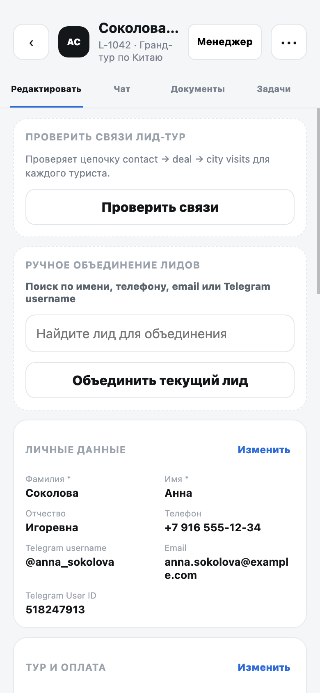

На карточке лида блок «Сводная по туру» объясняет, что логистика хранится на уровне тура. Кнопка открывает весь связанный тур с фильтром по участникам текущего лида.

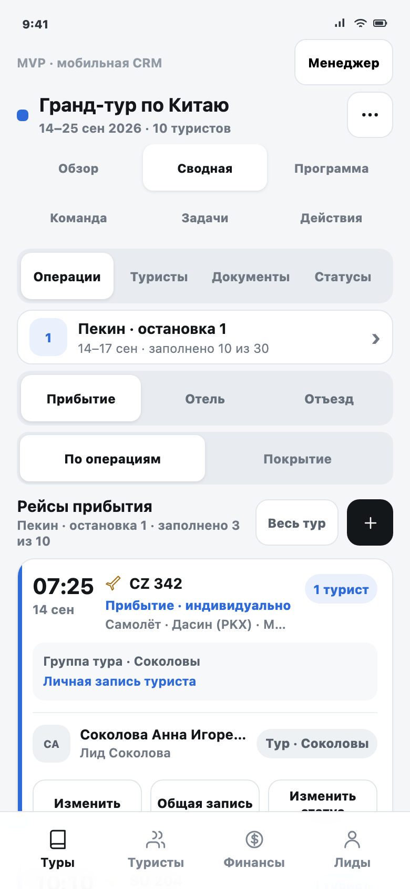

На основном экране одновременно видны выбранная остановка маршрута, одна из трёх операций, область «Этот лид / Весь тур» и тип каждой записи. Это мобильный эквивалент работы с выбранной ячейкой веб-таблицы.

### Два режима сводной

- **«По операциям»** нужен для заполнения и изменения конкретного рейса, отеля или отъезда.
- **«Покрытие»** показывает по каждому туристу и каждой доступной остановке, какие из трёх операций уже заполнены.

Покрытие сохраняет смысл широкой веб-таблицы, но помещает данные одного туриста в вертикальную карточку. Незаполненная ячейка открывает форму нужного города и операции.

### Два независимых уровня группировки

```text
Анна        Илья        Марина       Денис
  └──────── одна группа туристов на весь тур ────────┘

Отель       └────────── общая запись на 4 ──────────┘
Прибытие    └── рейс A · 2 ──┘ └── рейс B · 2 ─────┘
Отъезд      личный      личный      личный      личный
```

- `groupId` отвечает за состав группы туристов на уровне тура;
- `subgroupId` отвечает только за одну операцию в одной позиции маршрута;
- отделение от прибытия не меняет отель, отъезд или группу тура;
- объединение не копирует данные источника в индивидуальные записи участников.

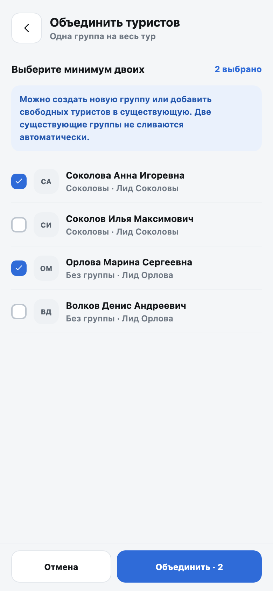

Свободного туриста можно добавить в одну существующую группу. Две существующие группы не сливаются автоматически: сначала одну из них нужно разъединить.

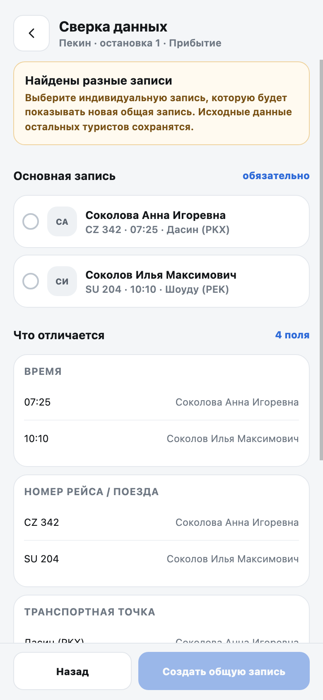

Если выбранные туристы имеют разные данные, система останавливает применение. Менеджер сравнивает поля и явно выбирает основную запись. До этого момента ничего не меняется; индивидуальные данные остальных туристов сохраняются.

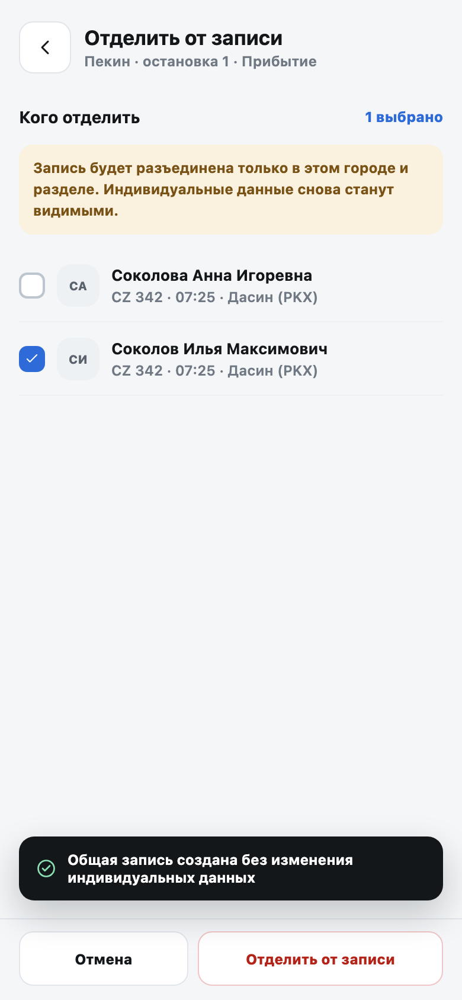

Разъединение выполняется в составе конкретной общей записи. Менеджер видит операцию, позицию маршрута, источник и участников, выбирает отделяемых туристов и подтверждает действие. Их личные данные снова становятся видимыми; общий отель, другие прибытия, отъезды и группа тура не изменяются.

### Единая карточка туриста

```text
ownValues + sourceVisitId → effectiveValues
личное       источник        отображается в сводной
```

Из лида, списка туристов, документов и операции открывается одна карточка по стабильному `touristId`. В ней собраны профиль, паспорта, сканы и OCR, маршрут, логистика, связи, группы и комментарии.

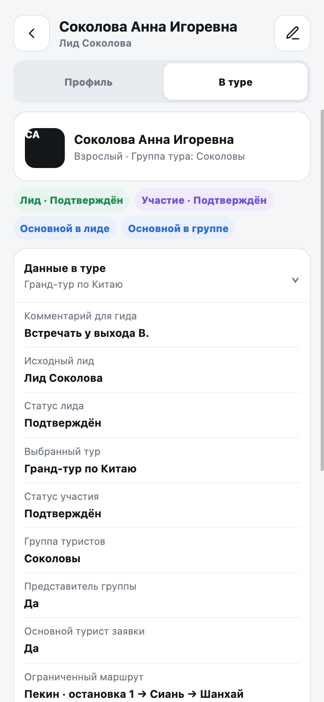

Для каждого города рядом показаны данные операции и её источник. Изменение личной записи меняет только `ownValues`. Если турист находится в общей записи, сводная продолжает показывать выбранный источник до разъединения.

### Роли и справочник

| Роль | Основная работа в MVP |
|---|---|
| Администратор | Все действия, удаление, управление турами и справочником |
| Менеджер | Профиль и документы назначенных лидов; логистика и группы всего доступного тура |
| Сопровождающий | Разрешённые поля и операционные статусы назначенного тура |
| `viewer`, подпись «Гид» | Read-only профиль; изменение разрешённых операционных статусов только назначенных городов |

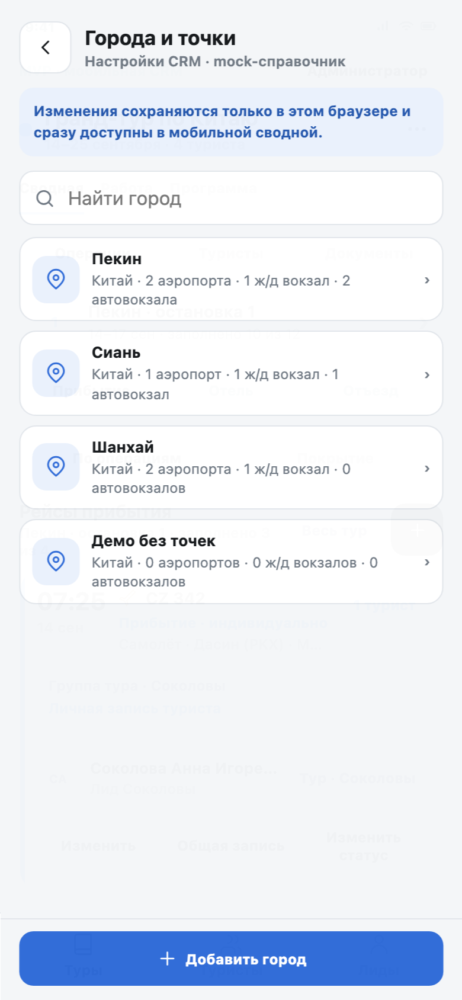

В форме самолёта доступны только аэропорты выбранного города, для поезда — ж/д вокзалы, для автобуса — автовокзалы. Одна активная точка предзаполняется только в пустое поле. Используемую точку можно архивировать, но нельзя удалить.

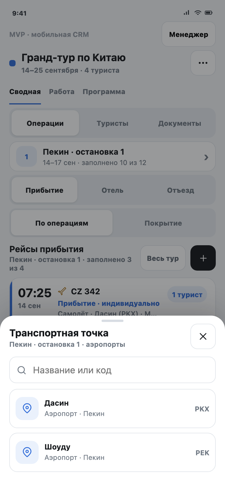

Поисковый экран показывает только точки подходящего типа и выбранного города. Если подходящей точки нет, пользователь может сохранить ручное значение с отметкой «Не из справочника».

#### Ролевые и системные сценарии

Роль `viewer` с подписью «Гид» видит назначенный тур, разрешённые города и разрешённые поля карточки без кнопок изменения профиля, документов, логистики и групп.

В контексте «Сводная → Статусы» пользователь выбирает статус встречи, заселения или отъезда явным действием. Статус не переключается скрытым циклом и меняется только для выбранного города и операции.

Offline-режим оставляет сохранённые данные доступными для чтения, постоянно показывает причину ограничений и блокирует любые mock-записи.

### Границы MVP

| Сейчас: кликабельный MVP | Следующий этап | Бэклог |
|---|---|---|
| Сводная, карточка туриста, группировка, конфликты, роли, состояния и mock-справочник | Production API, транзакции, серверные права, база городов и идемпотентные preview/apply/split | Виза, страховка, анкета, центральный чат, единый CRM-канбан и прочие административные модули |

Главный приёмочный сценарий использует выбранных четырёх туристов из двух лидов. В туре могут находиться туристы из других лидов; они не входят в создаваемую группу и не меняются:

`4 туриста → 2 лида → 1 группа тура → общий отель на 4 → прибытия 2 + 2 → разные отъезды → отделение одного туриста`

После отделения должны снова отображаться личные данные туриста. Другие операции и группа тура не меняются.

#### Состояния и адаптивность

- ошибка объясняет проблему и предлагает действие «Повторить»;
- пустое состояние объясняет отсутствие данных и следующий шаг;
- на 375×812 и 390×844 отсутствует горизонтальная прокрутка, а интерактивные области имеют размер не меньше 44×44 px.

#### Как воспроизвести сценарии

1. Чистое состояние: открыть прототип в приватном окне. Альтернатива для тестировщика — удалить из Local Storage только `unique-guide-tourists-v3`, `unique-guide-leads-v2`, `unique-guide-directory-v1` и `unique-guide-tourists-v3-mobile-migrated`, затем обновить страницу.
2. Основная сводная: открыть `tour-operations.html?tourId=china&role=manager&tourSection=summary`.
3. Конфликт: в «Прибытии» нажать «Общая запись» на индивидуальной карточке, выбрать минимум ещё одного туриста с другими данными, нажать «Далее», затем «Проверить», явно выбрать запись-источник на экране сверки и нажать «Создать общую запись».
4. Разъединение: после создания общей записи вернуться в «Прибытие», нажать «Состав · N» → «Отделить», выбрать туриста и подтвердить «Отделить от записи». Если отделяется текущий источник, выбрать новый источник для оставшихся участников.
5. Роль `viewer` с подписью «Гид»: открыть `tour-operations.html?tourId=china&role=viewer&view=tourists&tourist=t1`. Legacy-ссылка с `role=guide` допустима только для проверки нормализации в `viewer` с теми же ограничениями.
6. Рабочие статусы: открыть `tour-operations.html?tourId=china&view=statuses`, проверить активную цепочку «Сводная → Статусы» и нажать карточку участника.
7. Offline: открыть `tour-operations.html?tourId=china&role=manager&tourSection=summary&offline=1`.
8. Справочник и состояния: открыть меню тура; выбрать «Города и точки» или «Состояния экрана» в меню роли.

<span id="final-screens"></span>

## Финальные экраны прототипа

Ниже — актуальные экраны viewport 390×844. Номера поверх интерфейса связывают элемент с подписью. Скриншоты фиксируют мобильную композицию; точный ledger полей задают разделы 4 и 5.

<div class="screen-board">
  <figure class="annotated-shot">
    <div class="shot-frame">
      <a href="mobile-leads.html?lead=lead-1042&amp;tab=edit&amp;role=manager"></a>
      <span aria-hidden="true" class="marker blue" style="--x:19%;--y:12%">1</span>
      <span aria-hidden="true" class="marker" style="--x:90%;--y:26%">2</span>
      <span aria-hidden="true" class="marker purple" style="--x:86%;--y:39%">3</span>
      <span aria-hidden="true" class="marker amber" style="--x:19%;--y:68%">4</span>
    </div>
    <figcaption><strong>Карточка лида.</strong> 1 — четыре web-вкладки; 2 — проверка связей; 3 — ручное объединение лидов; 4 — точный порядок полей от «Личных данных» к «Туру и оплате».</figcaption>
  </figure>

  <figure class="annotated-shot">
    <div class="shot-frame">
      <a href="tour-operations.html?tourId=china&amp;tourSection=overview&amp;role=manager">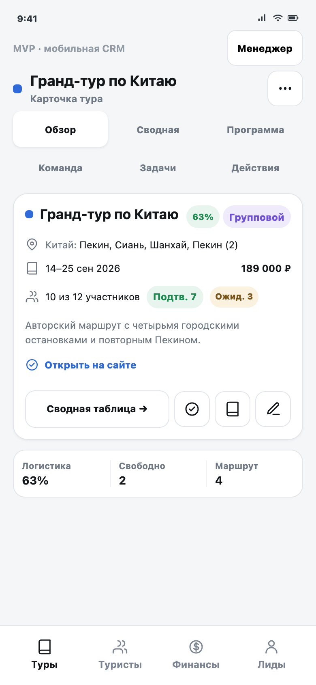</a>
      <span aria-hidden="true" class="marker blue" style="--x:17%;--y:19%">1</span>
      <span aria-hidden="true" class="marker" style="--x:87%;--y:32%">2</span>
      <span aria-hidden="true" class="marker purple" style="--x:17%;--y:53%">3</span>
      <span aria-hidden="true" class="marker amber" style="--x:83%;--y:94%">4</span>
    </div>
    <figcaption><strong>Обзор тура.</strong> 1 — шесть частей карточки; 2 — состояние тура; 3 — маршрут, даты, цена и участники в порядке EventCard; 4 — нижнее меню.</figcaption>
  </figure>

  <figure class="annotated-shot">
    <div class="shot-frame">
      <a href="tour-operations.html?tourId=china&amp;tourSection=summary&amp;role=manager"></a>
      <span aria-hidden="true" class="marker blue" style="--x:50%;--y:19%">1</span>
      <span aria-hidden="true" class="marker" style="--x:91%;--y:39%">2</span>
      <span aria-hidden="true" class="marker purple" style="--x:17%;--y:46%">3</span>
      <span aria-hidden="true" class="marker amber" style="--x:64%;--y:68%">4</span>
    </div>
    <figcaption><strong>Сводная тура.</strong> 1 — вход из карточки тура; 2 — стабильная позиция маршрута; 3 — прибытие, отель или отъезд; 4 — личная либо общая запись.</figcaption>
  </figure>

  <figure class="annotated-shot">
    <div class="shot-frame">
      <a href="tour-operations.html?tourId=china&amp;tourist=t1&amp;touristSection=profile&amp;role=manager">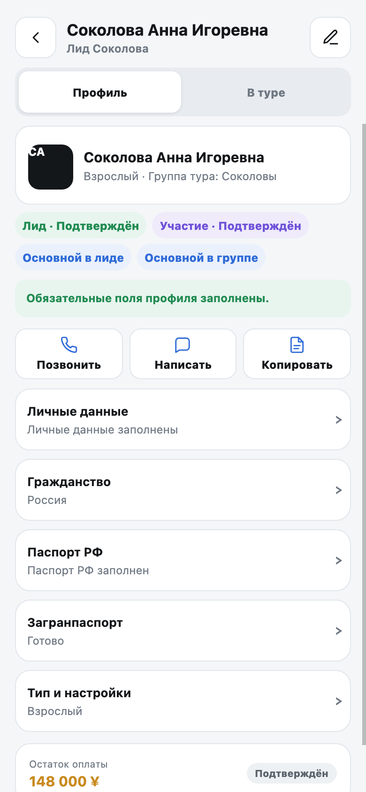</a>
      <span aria-hidden="true" class="marker blue" style="--x:75%;--y:12%">1</span>
      <span aria-hidden="true" class="marker" style="--x:22%;--y:29%">2</span>
      <span aria-hidden="true" class="marker purple" style="--x:50%;--y:41%">3</span>
      <span aria-hidden="true" class="marker amber" style="--x:91%;--y:51%">4</span>
    </div>
    <figcaption><strong>Профиль туриста.</strong> 1 — профиль или контекст тура; 2 — отдельные признаки лида, участия и основного туриста; 3 — готовность и контактные действия; 4 — пять раскрываемых разделов с точным web-порядком.</figcaption>
  </figure>

  <figure class="annotated-shot">
    <div class="shot-frame">
      <a href="tour-operations.html?tourId=china&amp;tourist=t1&amp;touristSection=tour&amp;expand=tour-context&amp;role=manager"></a>
      <span aria-hidden="true" class="marker blue" style="--x:18%;--y:29%">1</span>
      <span aria-hidden="true" class="marker" style="--x:18%;--y:46%">2</span>
      <span aria-hidden="true" class="marker purple" style="--x:18%;--y:66%">3</span>
      <span aria-hidden="true" class="marker amber" style="--x:18%;--y:89%">4</span>
    </div>
    <figcaption><strong>Турист в конкретном туре.</strong> 1 — выбранный тур; 2 — исходный лид и его статус; 3 — участие и группа; 4 — представитель, основной турист заявки и ограниченный маршрут. Выше карточки показаны отдельные плашки статусов, ниже — фактические статусы и личные/общие записи по остановкам.</figcaption>
  </figure>

  <figure class="annotated-shot">
    <div class="shot-frame">
      <a href="tour-operations.html?tourId=china&amp;tourSection=team&amp;role=manager">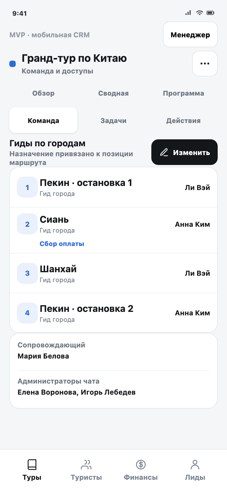</a>
      <span aria-hidden="true" class="marker blue" style="--x:17%;--y:37%">1</span>
      <span aria-hidden="true" class="marker" style="--x:25%;--y:50%">2</span>
      <span aria-hidden="true" class="marker purple" style="--x:17%;--y:67%">3</span>
      <span aria-hidden="true" class="marker amber" style="--x:84%;--y:80%">4</span>
    </div>
    <figcaption><strong>Команда тура.</strong> 1 — гиды по `routeCityId`; 2 — город сбора оплаты; 3 — сопровождающий; 4 — администраторы чата.</figcaption>
  </figure>

  <figure class="annotated-shot">
    <div class="shot-frame">
      <a href="tour-operations.html?tourId=china&amp;view=statuses&amp;role=manager">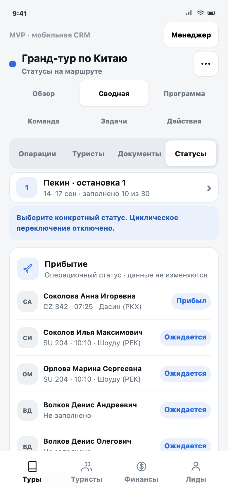</a>
      <span aria-hidden="true" class="marker blue" style="--x:87%;--y:33%">1</span>
      <span aria-hidden="true" class="marker" style="--x:87%;--y:43%">2</span>
      <span aria-hidden="true" class="marker purple" style="--x:18%;--y:61%">3</span>
      <span aria-hidden="true" class="marker amber" style="--x:84%;--y:77%">4</span>
    </div>
    <figcaption><strong>Статусы на маршруте.</strong> 1 — четвёртый режим сводной; 2 — конкретный `routeCityId`; 3 — прибытие, заселение и отъезд по участнику; 4 — явный выбор нового статуса без скрытого цикла.</figcaption>
  </figure>

  <figure class="annotated-shot">
    <div class="shot-frame">
      <a href="tour-operations.html?tourId=china&amp;view=finance&amp;role=manager">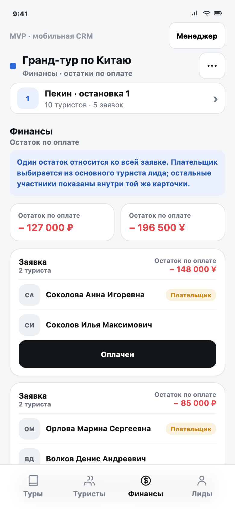</a>
      <span aria-hidden="true" class="marker blue" style="--x:18%;--y:17%">1</span>
      <span aria-hidden="true" class="marker" style="--x:80%;--y:31%">2</span>
      <span aria-hidden="true" class="marker purple" style="--x:18%;--y:51%">3</span>
      <span aria-hidden="true" class="marker amber" style="--x:50%;--y:80%">4</span>
    </div>
    <figcaption><strong>Финансы.</strong> 1 — capability-driven вкладка; 2 — отдельные итоги по валютам; 3 — одна карточка на заявку; 4 — плательщик, состав и идемпотентное действие «Оплачен».</figcaption>
  </figure>

  <figure class="annotated-shot">
    <div class="shot-frame">
      <a href="tour-operations.html?tourId=china&amp;showTours=1&amp;tourFilter=all&amp;role=manager">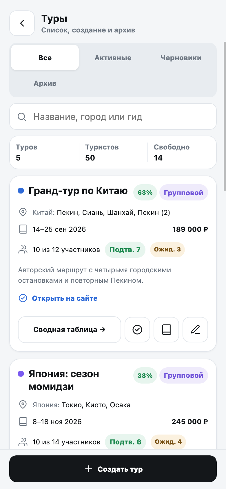</a>
      <span aria-hidden="true" class="marker blue" style="--x:18%;--y:13%">1</span>
      <span aria-hidden="true" class="marker" style="--x:83%;--y:23%">2</span>
      <span aria-hidden="true" class="marker purple" style="--x:20%;--y:48%">3</span>
      <span aria-hidden="true" class="marker amber" style="--x:82%;--y:76%">4</span>
    </div>
    <figcaption><strong>Пять туров.</strong> 1 — поиск и фильтры; 2 — статус и заполненность; 3 — ровно 10 туристов в карточке; 4 — активные, черновые и архивные данные для проверки длинного списка.</figcaption>
  </figure>

  <figure class="annotated-shot">
    <div class="shot-frame">
      <a href="tour-operations.html?tourId=china&amp;role=viewer">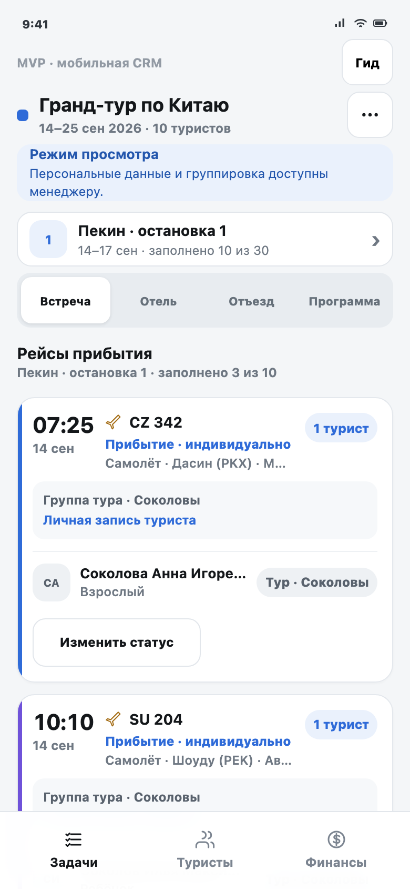</a>
      <span aria-hidden="true" class="marker blue" style="--x:18%;--y:12%">1</span>
      <span aria-hidden="true" class="marker" style="--x:50%;--y:31%">2</span>
      <span aria-hidden="true" class="marker purple" style="--x:18%;--y:59%">3</span>
      <span aria-hidden="true" class="marker amber" style="--x:50%;--y:94%">4</span>
    </div>
    <figcaption><strong>Первая редакция гида сохранена.</strong> 1 — роль и назначенный тур; 2 — только доступные позиции маршрута; 3 — прежняя операционная работа; 4 — нижнее меню начинается с «Задач», «Лиды» отсутствуют, «Финансы» появляются только при разрешении.</figcaption>
  </figure>
</div>

<div class="scenario-flow" aria-label="Главный сценарий группировки">
  <ol>
    <li><strong>Лид</strong><span>Тур и туристы</span></li>
    <li><strong>Подтверждение</strong><span><code>status=converted</code></span></li>
    <li><strong>Сводная</strong><span>Остановка и операция</span></li>
    <li><strong>Группа тура</strong><span>Один <code>deal.groupId</code></span></li>
    <li><strong>Общая операция</strong><span>Отель, прибытие или отъезд</span></li>
    <li><strong>Конфликт</strong><span>Preview → source → apply</span></li>
    <li><strong>Split</strong><span>Возврат личных <code>ownValues</code></span></li>
  </ol>
</div>

## 1. Цель и границы

Веб-«Сводная таблица» работает с участником конкретного тура, его индивидуальными данными и независимыми общими записями логистики. В текущей мобильной версии турист и сводная реализованы несколькими несовместимыми способами. Задача прототипа: объединить их вокруг раздела «Туры», одной карточки туриста и одной модели групп.

Текущий этап меняет только статический прототип, mock-данные, smoke-тест и это ТЗ. Рабочее мобильное приложение, desktop, API, база данных и серверные права не изменяются.

- **SCOPE-01.** Прототип не обращается к production API и внешним ресурсам. Все изменения выполняются в памяти или `localStorage`.
- **SCOPE-02.** Публичная шапка содержит один продуктовый пункт «Лиды, туры и сводная». Внутри manager-сценария доступны «Туры → Туристы → Финансы → Лиды»; для `viewer/escort` сохраняется оболочка первой редакции «Задачи → Туристы» и условные «Финансы».
- **SCOPE-03.** Лид, турист и тур остаются разными сущностями и контекстами одного сценария. Из назначенного лида открывается сводная того же тура с фильтром «Этот лид» и гарантированным возвратом.
- **SCOPE-04.** Прежнее ТЗ приложения гида и рабочие приложения не изменяются; его работа зафиксирована как обязательная регрессионная база, а меняется только изолированный MVP-прототип текущей задачи.
- **SCOPE-05.** Markdown-файл является единственным источником требований текущей задачи.

## 1.1. Этап MVP и основные пользовательские сценарии

Текущая разработка обозначается как этап **MVP мобильной CRM**. Его задача — проверить на кликабельном прототипе основную ежедневную работу веб-«Сводной таблицы» до переноса в рабочее приложение и подключения production API.

MVP считается пригодным для следующего этапа, если менеджер может подготовить один тур целиком с телефона, а viewer с подписью «Гид» или сопровождающий может получить разрешённые данные и отметить фактическое выполнение операций без доступа к лидам и закрытым персональным полям.

| Сценарий веб-версии | Роль | Мобильный путь | Ожидаемый результат |
|---|---|---|---|
| Создать лид и основной профиль | Manager / Admin | «Лиды» → «Создать» → анкетные и паспортные блоки | Лид и автоматически созданный основной турист используют те же поля, что web LeadForm |
| Добавить остальных туристов | Manager / Admin | Лид → «Редактировать» → «Туристы» → «Добавить» | Каждый турист независим и открывается в канонической карточке |
| Подготовить логистику тура | Manager / Admin | «Туры» → тур → «Сводная» → остановка → операция | Видны все участники тура и покрытие прибытия, отеля и отъезда |
| Исправить данные одного туриста | Manager / Admin | Карточка туриста → «Маршрут и логистика» → «Изменить личную запись» | Меняются только `ownValues` выбранного туриста |
| Создать общие записи | Manager / Admin | Выбрать туристов из разных лидов → создать группу тура → отдельно объединить операции | Общий отель, прибытия и отъезды имеют независимые `subgroupId` |
| Разрешить конфликт | Manager / Admin | Массовое действие → «Сверка данных» → выбрать источник → применить | Общая запись ссылается на выбранный `sourceVisitId`, личные данные остальных сохраняются |
| Отделить от одной операции | Manager / Admin | Общая запись → «Состав» → «Отделить» | Личная логистика снова видна; другие операции и `groupId` не меняются |
| Расформировать группу тура | Manager / Admin | Группа тура → «Расформировать» → подтверждение | Зависимые общие связи снимаются, индивидуальные значения сохраняются |
| Дозаполнить профиль и документы | Manager / Admin | «Туристы» или «Документы» → карточка → нужный раздел → OCR/редактирование | Готовность пересчитывается, OCR применяет только выбранные поля |
| Работать из конкретного лида | Manager | «Лиды» → лид → «Сводная по туру» | Открывается тот же тур с областью «Этот лид» и возвратом в прежний контекст |
| Отметить факт выполнения | Manager / `viewer` («Гид») / Escort | Тур → «Сводная» → «Статусы» → встреча, заселение или отъезд | Меняется только разрешённый операционный статус выбранного города |
| Обновить тур, программу и команду | Manager / Admin | Тур → «Обзор / Программа / Команда / Задачи» | Поля, назначения и TaskWidget сохраняют web-порядок и роли |
| Перенести стыковку между городами | Manager / Admin | Сохранить отъезд → открыть следующую остановку | Заполняются только пустые соответствующие поля следующего прибытия |
| Выгрузить сводную | Manager / Admin | Тур → «Сводная» → «Excel» | Создаётся файл только по доступному составу без изменения CRM |
| Получить остаток оплаты | Manager / Admin / назначенный финансовый гид / роли Morocco | «Финансы» → заявка → «Оплачен» | Меняется только `remainingPaymentCollected`; сумма и состав заявки сохраняются |
| Обслужить справочник | Admin | Меню тура → «Города и точки» | Изменённые mock-точки сразу используются в формах; используемые записи архивируются |
| Проверить данные в поле | `viewer` («Гид») / Escort | Тур → сводная или карточка туриста | Доступны только назначенный тур/города и разрешённые поля без мутаций логистики |
| Продолжить работу первой редакции | `viewer` («Гид») / Escort | «Задачи» → город → встреча, отель, отъезд или программа | Сохраняются прежняя стартовая область, контакты, статусы и доступная нижняя навигация |

- **MVP-01.** Текущая разработка является MVP мобильной CRM и проверяет основные сценарии веб-«Сводной таблицы» в кликабельном прототипе.
- **MVP-02.** В границы MVP входят единая сводная тура, одна карточка туриста, индивидуальная и групповая логистика, документы, операционные статусы, роли, остатки оплаты и mock-справочник.
- **MVP-03.** Рабочее приложение, production API, база данных и серверные права остаются следующим этапом после проверки и согласования MVP.
- **FLOW-01.** Менеджер открывает «Туры → Тур → Сводная», выбирает позицию маршрута и операцию и видит всех доступных участников и покрытие данных.
- **FLOW-02.** Менеджер изменяет личную запись одного туриста без изменения общей записи и личных данных других участников.
- **FLOW-03.** Менеджер выбирает ровно четырёх туристов из двух лидов одного тура, объединяет их в группу и независимо создаёт общие прибытия, отель и отъезды. Другие участники этого тура остаются вне выбранной группы и не меняются.
- **FLOW-04.** При конфликте менеджер сначала сверяет варианты и явно выбирает источник; до подтверждения данные не меняются.
- **FLOW-05.** Менеджер отделяет туриста от одной общей операции и получает сохранённые личные значения без изменения других операций или группы тура.
- **FLOW-06.** Менеджер открывает единую карточку туриста, дозаполняет профиль и документы, проверяет OCR и видит пересчитанную готовность.
- **FLOW-07.** Менеджер открывает сводную из лида с областью «Этот лид» и возвращается в тот же раздел, фильтры и позицию прокрутки.
- **FLOW-08.** Manager, viewer или escort меняет разрешённый операционный статус явным выбором только в доступном туре и городе.
- **FLOW-09.** Администратор управляет mock-справочником городов и точек, а мобильные формы сразу используют актуальные активные записи.
- **FLOW-10.** Роли `viewer` и `escort` просматривают только разрешённые поля назначенного тура, не видят раздел «Лиды» и не могут изменить профиль, логистику, группы или документы.
- **FLOW-11.** Менеджер полностью расформировывает группу тура; зависимые общие связи снимаются, а индивидуальные данные всех участников сохраняются.
- **FLOW-12.** Пользователь с доступом к «Финансам» видит остатки по заявкам, плательщиков и валютные итоги, отмечает получение или отменяет отметку без изменения суммы.
- **FLOW-13.** Гид начинает работу в прежней области «Задачи», выбирает назначенный город и продолжает сценарии встречи, отеля, отъезда, программы и туристов без доступа к лидам.

## 1.2. Публикация MVP без слияния

Текущая разработка хранится только в ветке `prototype/mobile-crm-2026-08-03`. Этот этап не создаёт PR и не сливается в `main` или `develop`, но именно эта ветка является источником согласованной публикации GitHub Pages.

Финальная передача содержит точный commit SHA и три проверенные страницы: прототип, ТЗ и КП. Контрольная сумма Markdown, сгенерированный HTML, скриншоты, результаты smoke и опубликованная версия относятся к одному commit SHA.

- **DELIVERY-01.** Все файлы MVP находятся в `prototype/mobile-crm-2026-08-03`; `main` и `develop` не меняются.
- **DELIVERY-02.** Для текущего этапа не создаются PR и merge; Pages публикует прототипную ветку.
- **DELIVERY-03.** `https://nvrtsky.github.io/unique-guide-app/tour-operations.html` отвечает HTTP 200 и показывает текущий единый MVP.
- **DELIVERY-04.** Рядом без 404 открываются `mobile-leads-tz.html` и `commercial-proposal.html`.
- **DELIVERY-05.** HTML, скриншоты и результаты проверок воспроизводятся из указанного SHA без незакоммиченных файлов.

## 2. Каноническая модель участника тура

Участник тура собирается из цепочки:

`LeadTourist → Contact → Deal → CityVisit`

- `leadTouristId` хранит анкету и паспортные данные.
- `contactId` связывает контакт и чат.
- `dealId` связывает участие в туре, группу и операционные статусы.
- `leadId` указывает исходный лид.
- `groupId` обозначает группу туристов на уровне тура.
- `routeCityId + cityIdx` однозначно обозначают позицию маршрута.
- `subgroupId` обозначает общую запись одной операции в одной позиции маршрута.

Технические поля `order`, `isAutoCreated`, даты создания и внутренние ID не показываются в обычной карточке.

- **MODEL-01.** Все входы из «Лидов», «Туристов», «Операций» и «Документов» открывают одну каноническую карточку по стабильному `touristId`.
- **MODEL-02.** ФИО, телефон, email, дата рождения, паспортные данные, комментарии и связи имеют один mock-источник и одинаково отображаются во всех разделах.
- **MODEL-03.** Возврат из карточки сохраняет исходный тур, город, этап, фильтр по лиду и режим списка.
- **MODEL-04.** Ограниченный маршрут туриста хранится как список `routeCityId`, а не названий городов.

## 3. Информационная архитектура

```text
Единый публичный вход «Лиды, туры и сводная»
└─ Manager / Admin
├─ Туры
│  └─ Карточка тура
│     ├─ Обзор
│     ├─ Сводная
│     │  ├─ Операции
│     │  ├─ Туристы
│     │  ├─ Документы
│     │  └─ Статусы
│     ├─ Программа
│     ├─ Команда
│     ├─ Задачи
│     └─ Действия
├─ Туристы
│  └─ Единая карточка
│     ├─ Профиль
│     └─ В туре
├─ Финансы [по capabilities]
└─ Лиды [только admin / manager]
   └─ Карточка лида
      ├─ Редактировать
      ├─ Чат
      ├─ Документы
      └─ Задачи

Viewer / Escort · первая редакция
├─ Задачи
├─ Туристы
└─ Финансы [только при действующем доступе]
```

Витрина и продукт едины. Внутренние области нужны для понятной навигации по разным сущностям и правам. «Туристы» открывает ту же каноническую карточку, которая доступна из лида и сводной. Роли `viewer` и `escort` не получают «Лиды». «Финансы» появляются только при том же capability, что в рабочем приложении.

- **IA-01.** Для admin и manager нижнее меню идёт `Туры → Туристы → Финансы → Лиды`, если Finance разрешён; для viewer и escort сохраняется `Задачи → Туристы → Финансы при доступе`, без «Лидов».
- **IA-02.** Карточка тура идёт строго `Обзор → Сводная → Программа → Команда → Задачи → Действия`.
- **IA-03.** Карточка лида идёт строго `Редактировать → Чат → Документы → Задачи`.
- **IA-04.** Базовый профиль и контекст конкретного тура — два режима одной карточки туриста, а не две сущности.
- **IA-05.** Для сводной доступны области «Весь тур» и «Этот лид». Область меняет только видимый состав.
- **IA-06.** Позиция маршрута выбирается одной кнопкой, открывающей полноэкранный список городов.
- **IA-07.** Горизонтальная таблица и длинная горизонтальная лента городов не используются.
- **IA-08.** Повторяющийся город подписывается номером остановки и датами. Его операции не смешиваются с другой остановкой.
- **IA-09.** Возврат из лида, туриста или операции сохраняет тур, `routeCityId`, область, фильтры и позицию прокрутки.
- **IA-10.** Вложенные режимы сводной идут строго `Операции → Туристы → Документы → Статусы`. Прямая ссылка `tour-operations.html?tourId={tourId}&view=statuses` открывает карточку тура, активирует «Сводная → Статусы» и сохраняет остальные параметры контекста.
- **IA-11.** Публичная шапка не содержит отдельных пунктов «Лиды» и «Туры и сводная»; технический deep link карточки лида не считается отдельной редакцией продукта.

## 4. Карточки лида и тура

Мобильная компоновка может быть вертикальной, полноэкранной или разбитой на раскрывающиеся блоки. Название, смысл и порядок web-разделов и полей менять нельзя.

### 4.1. Карточка лида

Верхний уровень повторяет `LeadEditModal`:

1. «Редактировать»;
2. «Чат»;
3. «Документы»;
4. «Задачи».

#### Вкладка «Редактировать» существующего лида

Порядок сверху вниз:

1. «Проверить связи лид–тур» — только для лида с туром и разрешённой роли;
2. «Ручное объединение лидов» — поиск по всем неархивным лидам, направление переноса данных и preview;
3. «Личные данные»;
4. «Тур и оплата»;
5. «Настройки»;
6. «UTM-трекинг» — только для чтения и только при наличии хотя бы одного значения;
7. «Примечание»;
8. «Туристы»;
9. нижние действия web-формы;
10. мобильный переход «Сводная по туру» после канонической формы.

На телефоне вкладка «Редактировать» использует два слоя. Lead Read surface показывает актуальные значения карточками в указанном выше порядке. Кнопка «Изменить» у блока открывает полноэкранный редактор и сразу переводит фокус к выбранному блоку.

Полноэкранный редактор использует ту же каноническую форму, а не сокращённую копию. Блоки остаются в web-порядке, поля выбранного блока идут в порядке таблицы ниже, проверки и outcome flow не меняются. Закрытие возвращает пользователя на прежний блок и позицию прокрутки Lead Read surface. Действия «Проверить связи» и «Ручное объединение» остаются перед карточками, footer идёт после «Туристов», а «Сводная по туру» располагается после footer.

| Блок | Поля в точном порядке |
|---|---|
| Личные данные | Фамилия → Имя → Отчество → Телефон → Telegram username → Email → Telegram User ID, только чтение и только при наличии |
| Тур и оплата | Тур с поиском → позиции маршрута по стабильным `routeCityId` → стоимость тура → валюта стоимости → аванс → валюта аванса → остаток → валюта остатка → статус оплаты, только чтение → способ оплаты, только чтение → booking ID, только чтение → тип номера → категория отелей → трансферы → питание |
| Настройки | Категория клиента → статус → источник → ответственный → цветовой индикатор |
| UTM-трекинг | `utmSource → utmMedium → utmCampaign → utmTerm → utmContent → pageUrl` |
| Примечание | `notes` |

Статусы используют действующий контракт: `new=Новый`, `contacted=Квалифицирован`, `qualified=Забронирован`, `converted=Подтверждён`, `lost=Отложен` (`lostFilter=Отложен/потерян`). Выбор `lost` открывает отдельный outcome flow: `postponed` требует дату и причину; `failed` требует причину потери. Отмена не меняет статус.

Нижняя строка формы идёт `Удалить лид` только администратору → `Обновить`. Переход «Сводная по туру» не вклинивается между этими действиями.

#### Создание лида

До первого сохранения используются те же поля, но другой состав блоков:

`Личные данные → Дата рождения → Паспорт РФ → Загранпаспорт → Тур и оплата → Настройки → Примечание → Создать`.

Дата рождения и оба паспортных блока записываются в автоматически создаваемого основного туриста. Проверка связей, ручное объединение, UTM, четыре вкладки карточки и список туристов появляются только после первого сохранения. Остальных туристов менеджер добавляет затем через «Добавить туриста».

#### Остальные вкладки лида

- «Чат» воспроизводит семь состояний `Wazzup24Chat`: не настроен, нет контакта, загрузка, ошибка, пустой URL, iframe готов, сообщение о сохранённом channel ID. Прототип ничего не загружает извне.
- «Документы» содержит ровно «Договор» и «Лист бронирования» с действиями подготовки DOCX.
- «Задачи» повторяют `TaskWidget`: счётчики и группы `todo → in_progress → done`, название, описание, приоритет `low | medium | high | urgent`, срок, просрочку, карточку изменения и подтверждение удаления. Статуса `cancelled` нет.
- Логистика закрыта до `status=converted`. После подтверждения «Открыть сводную тура» передаёт `tourId`, область «Этот лид» и контекст возврата.

- **LEAD-01.** Четыре вкладки, Lead Read surface, блоки полноэкранного редактора и поля идут в указанном порядке; переход между слоями не переставляет действия и не создаёт вторую модель лида.
- **LEAD-02.** Create-flow не показывает edit-only блоки и создаёт одного основного туриста из анкетных полей.
- **LEAD-03.** Тур выбирается поиском, а ограниченный маршрут хранит ID позиций, а не текстовые названия.
- **LEAD-04.** Ручное объединение не вводит искусственный запрет по разным турам: пользователь выбирает направление и подтверждает preview.
- **LEAD-05.** Из лида доступны «Добавить туриста», единая карточка туриста и сводная связанного тура.
- **LEAD-06.** Роли `viewer` и `escort` не получают пункт «Лиды», список, карточку или данные лида по прямой ссылке. Manager получает список и карточки только назначенных лидов. Delete доступен только admin.
- **LEAD-07.** Прямой URL запрещённого лида открывает экран `forbidden` без ФИО, контактов, туристов и других данных лида; запрет нельзя обойти программным кликом.

### 4.2. Карточка тура

Web не имеет одной формы с названием «карточка тура». Mobile aggregator сохраняет контракты трёх действующих поверхностей: `EventCard`, `EditEventDialog` и `EventSummary`.

#### Список и «Обзор»

Порядок `EventCard`:

1. цветовой индикатор, если включён;
2. название, заполненность логистики, тип тура и системные плашки архива/отмены;
3. страна и города;
4. даты и базовая цена с валютой, если роль вправе видеть;
5. забронированные места и лимит, затем подтверждённые, ожидающие, отменённые и плашка заполнения;
6. описание;
7. сайт, если роль вправе видеть;
8. действия `Сводная → открыть сводную в новой вкладке → копировать → изменить → удалить` с учётом права и переданного handler.

Роль `viewer` с подписью «Гид» видит даты только назначенных позиций маршрута. Для `viewer` и `escort` цена и сайт скрыты.

#### Полноэкранное изменение тура

Порядок `EditEventDialog`:

1. название;
2. описание;
3. URL сайта;
4. страна;
5. тип тура;
6. позиции маршрута `routeCities` в сохранённом порядке: добавление, удаление и перемещение;
7. гид каждой позиции по `routeCityId` и признак города сбора оплаты;
8. сопровождающий;
9. администраторы чата;
10. дата начала;
11. дата окончания;
12. лимит участников;
13. базовая цена;
14. валюта;
15. цвет;
16. контекстные действия lifecycle и `Отмена → Сохранить`.

Пользовательские селекторы работают по существующим user ID, поддерживают поиск и повторяют доступные web-роли. Team — read-only проекция тех же назначений, а не второй набор данных.

#### Остальные разделы тура

- «Сводная» содержит участников, лиды, группы, логистику, покрытие и фактические статусы.
- «Программа» хранит `dayNumber → date → city → cityIdx → description`. `dayNumber` и `date` read-only; редактируются только город и описание. Произвольного добавления/удаления дня и поля `title` нет. Доступны генерация каркаса, повторная генерация, очистка с подтверждением и шаблоны описаний.
- «Команда» показывает гидов по позициям маршрута, город сбора оплаты, сопровождающего и администраторов чата.
- «Задачи» используют тот же `TaskWidget(entityType=event)` с `todo | in_progress | done`.
- «Действия» сохраняют порядок `EventCard` и отдельно показывают разрешённые lifecycle-действия.

Close/reopen доступны admin и manager; archive/unarchive и delete — только admin в мобильном UI. Отменённый тур остаётся в фильтре «Архив» и может быть открыт повторно. Архивирование запоминает предыдущее состояние: черновик после восстановления остаётся черновиком. Копия любого тура всегда создаётся чистым неархивным черновиком без причины отмены. Все lifecycle-действия сохраняют туристов, документы и логистику и синхронно меняют архив связанных лидов согласно текущему web-поведению.

- **TOUR-01.** Шесть разделов идут `Обзор → Сводная → Программа → Команда → Задачи → Действия`.
- **TOUR-02.** Overview и список сохраняют точный порядок `EventCard`, включая ролевое скрытие цены и сайта.
- **TOUR-03.** Форма изменения сохраняет все поля `EditEventDialog` от названия до цвета и не подмешивает в саму форму выдуманные поля прибыли или расходов. Остатки оплаты открываются отдельным capability-driven экраном «Финансы».
- **TOUR-04.** Программа и задачи используют действующие web-модели без придуманных полей и статусов.
- **TOUR-05.** Lifecycle-действия видны только в разрешённых состоянии и роли; повторное открытие допустимо только из состояния «Отменён», а запрещённый программный клик ничего не меняет.
- **TOUR-06.** Позиция маршрута, её `routeCityId` и назначенный пользователь сохраняются одной связкой. Пустая промежуточная строка не сдвигает гида следующего города; выбранный город сбора оплаты сохраняется только пока эта позиция остаётся в маршруте.
- **TOUR-07.** Ссылка на публичную страницу тура в прототипе является локальным mock-действием: она объясняет будущее поведение, но не открывает внешний адрес и не создаёт сетевой запрос.

## 5. Единая карточка туриста

Web содержит две близкие поверхности: `TouristDialog` внутри лида и `TouristDetailsDialog` в сводной. Mobile не выбирает одну из них и не создаёт третью модель. Он показывает один базовый профиль, а данные участия и логистики добавляет только в контексте конкретного тура.

Первый экран содержит только разрешённые конкретной роли данные и действия. Admin и manager назначенного лида видят полный профиль, готовность, контакты и оба независимых признака «основной». Manager доступного тура, которому исходный лид туриста не назначен, видит имя и операционный контекст участия, но не видит исходный лид, контакты, анкету, документы, заметку и признаки основного туриста. Роли `viewer` и `escort` получают только закрытый перечень раздела 10.

### 5.1. Профиль: пять web-разделов

| № | Раздел | Поля в точном порядке |
|---:|---|---|
| 1 | Личные данные | Фамилия → Имя → Отчество → Дата рождения → Email → Телефон |
| 2 | Гражданство | Россия / Казахстан |
| 3 | Паспорт РФ | Серия и номер → Кем выдан → Адрес регистрации |
| 4 | Загранпаспорт и сканы | ФИО латиницей → Номер → Годен до → Список сканов → Загрузить/сфотографировать → Просмотреть → Удалить → OCR |
| 5 | Тип и настройки | Взрослый/ребёнок/младенец → Основной турист заявки → Заметка `leadTourists.notes` |

Для гражданина Казахстана паспорт РФ скрывается, но сохранённые ранее значения не удаляются. Форма сохранения требует только фамилию и имя. Nullable-поля можно оставить пустыми; индикатор готовности показывает, что нужно дозаполнить, но не запрещает сохранить черновик.

OCR всегда открывает сверку распознанных и текущих значений. Отмена ничего не меняет. Apply меняет только отмеченные пользователем поля.

### 5.2. «В туре»: контекст конкретного участия

Контекст строится по `eventId + dealId` и идёт в таком порядке:

1. комментарий для гида `guideComment`;
2. исходный лид и его статус;
3. выбранный тур и статус участия;
4. группа туристов `deal.groupId`;
5. представитель группы и `deal.isPrimaryInGroup`;
6. «Основной турист заявки» `leadTourist.isPrimary` как отдельный признак;
7. ограниченный маршрут лида `selectedCityIds`;
8. три фактических статуса: прибытие, заселение, отъезд;
9. логистика по каждой доступной позиции `routeCityId`: личное значение, отображаемое значение, тип связи и источник общей записи.

`leadTourist.isPrimary` и `deal.isPrimaryInGroup` нельзя сворачивать в одну плашку: первый относится к заявке, второй — к группе в конкретном туре. Ограниченный маршрут также не становится полем туриста; он читается из текущего лида.

### 5.3. Переходы и действия

- один `touristId`, открытый из лида, списка, документов, покрытия и операции, показывает один профиль;
- tour-context соответствует выбранному `dealId/eventId`, поэтому один человек может иметь разный контекст в разных турах;
- возврат сохраняет исходный тур, остановку, операцию, область, фильтры и прокрутку;
- редактируется отдельный раздел, а не бесконечная форма; закрытие изменённого раздела требует подтверждения;
- номер паспорта не показывается в общем списке;
- основной турист заявки только один; снять признак у текущего основного можно только одновременным выбором другого;
- удалить туриста может только admin; последнего туриста лида удалять нельзя.

- **CARD-01.** Базовый профиль содержит ровно пять разделов в указанном порядке; гражданство и тип не переносятся в «Личные данные».
- **CARD-02.** Tour-context не дублирует анкету и появляется только при конкретном участии.
- **CARD-03.** Изменение профиля сохраняется в одном mock-источнике и видно при следующем входе из любого раздела.
- **CARD-04.** OCR и dirty-confirmation защищают текущие значения от неявного изменения.
- **CARD-05.** Сканы доступны для загрузки, просмотра, OCR и удаления только по capability.
- **CARD-06.** В карточке явно различены основной турист заявки и представитель группы тура.
- **CARD-07.** Из логистики туриста можно перейти в нужную операцию конкретного `routeCityId`.
- **CARD-08.** `notes` скрыта от viewer/escort, а `guideComment` доступен им только в разрешённом tour-context.
- **CARD-09.** Роли `viewer` и `escort` видят имя одной строкой `displayName`; отдельные поля фамилии, имени и отчества не выводятся в раскрытом разделе, DOM, экспорте или параметрах перехода.

## 6. Готовность и статусы

Сохранение и готовность — разные проверки. `insertLeadTouristSchema` требует только фамилию и имя. Остальные поля nullable. Готовность — подсказка менеджеру, а не запрет сохранить промежуточную анкету.

Статусы не объединяются в одну плашку:

- статус лида;
- статус участия в туре;
- прибытие: `expected | arrived`;
- отель: `pending | checked_in`;
- отъезд: `pending | departed`;
- готовность личных данных;
- готовность документов.

- **READY-01.** Личные данные готовы при наличии фамилии, имени и даты рождения. Для основного туриста также нужны отчество, email и телефон.
- **READY-02.** Паспорт РФ основного гражданина России готов при наличии серии/номера и органа выдачи. Для неосновного пустой раздел может иметь статус «Не требуется».
- **READY-03.** Загранпаспорт готов только при наличии ФИО латиницей, номера, срока действия и минимум одного скана.
- **READY-04.** Проблема срока действия показывается отдельно от отсутствующего документа.
- **STATUS-01.** Операционный статус изменяется через явный action sheet. Циклического переключения одной кнопкой нет.
- **STATUS-02.** Изменение статуса не меняет данные прибытия, отеля или отъезда.

## 7. Мобильная сводная

Внутри раздела тура «Сводная» доступны рабочие режимы `Операции → Туристы → Документы → Статусы` в этом порядке. Это вложенные режимы одного раздела, а не отдельные пункты нижнего меню. Deep link `tour-operations.html?tourId={tourId}&view=statuses` открывает тот же participant aggregate сразу в режиме «Статусы» и оставляет верхний раздел «Сводная» активным.

В «Операциях» после выбора остановки пользователь выбирает «Прибытие», «Отель» или «Отъезд». Контент состоит из вертикальных карточек без горизонтальной таблицы.

Карточка показывает:

- «Общая запись», «Индивидуально», «Без данных» или «Конфликт»;
- реквизиты операции;
- не более двух имён и «Ещё N»;
- группу туристов;
- источник общей записи;
- покрытие участников;
- действия «Изменить», «Состав», «Добавить туристов», «Отделить» и «Изменить статус» согласно контексту.

Порядок полей соответствует активным ячейкам web-сводной:

| Операция | Поля |
|---|---|
| Прибытие | Дата → Время → Транспорт `самолёт | поезд | автобус` → Номер рейса/поезда/автобуса → Аэропорт/вокзал → Трансфер |
| Отель | Название отеля → Тип номера |
| Отъезд | Дата → Время → Транспорт `самолёт | поезд | автобус` → Номер рейса/поезда/автобуса → Аэропорт/вокзал → Трансфер |

- **OPS-01.** Прибытие содержит дату, время, транспорт, номер, транспортную точку и трансфер.
- **OPS-02.** Отель содержит название и тип номера в этом порядке.
- **OPS-03.** Отъезд содержит дату, время, транспорт, номер, транспортную точку и трансфер.
- **OPS-04.** Индивидуальная запись редактирует только выбранного туриста.
- **OPS-05.** Общая запись редактирует только выбранную индивидуальную запись-источник. Личные значения остальных участников не меняются.
- **OPS-06.** Одинаковые отображаемые значения сами по себе не создают общую запись.
- **OPS-07.** Повторное применение того же действия не создаёт дубликат.
- **OPS-08.** Экспорт различает повторяющиеся остановки и не раскрывает чувствительные поля read-only ролям.
- **OPS-09.** Сохранённое непустое поле отъезда заполняет только пустое соответствующее поле прибытия `cityIdx + 1`; существующее прибытие не перезаписывается. Прототип выполняет это правило на mock-данных.
- **OPS-10.** Создание и изменение логистики доступно только участникам подтверждённого лида; неподтверждённый участник остаётся видимым с объяснением ограничения.
- **OPS-11.** Экспорт доступной сводной создаёт локальный Excel-совместимый файл в прототипе и не выполняет запись. Production использует действующий XLSX-exporter и системное меню «Поделиться».
- **OPS-12.** «Операции», «Туристы», «Документы» и «Статусы» идут в заданном порядке, открывают тот же participant aggregate и ту же единую карточку, не создавая отдельные данные.
- **OPS-13.** Параметр `view=statuses` открывает «Сводная → Статусы» напрямую; возврат сохраняет `tourId`, `routeCityId`, область и фильтры.

## 8. Два независимых уровня группировки

Пример:

```text
Группа туристов: Анна + Борис + Виктор + Галина
├─ Прибытие: Анна+Борис / Виктор+Галина
├─ Отель: все четверо
└─ Отъезд: Анна / Борис+Виктор / Галина
```

`groupId` связывает участников на уровне тура. `subgroupId` связывает одну операцию в одной позиции маршрута. Индивидуальные значения всегда сохраняются.

- **GROUP-01.** Новая группа создаётся из двух или более свободных сделок одного тура, в том числе из разных лидов. Первый выбранный участник становится представителем. Интерфейс строит стартовую подпись из фамилий первых двух выбранных участников; эта подпись не является идентификатором группы и не записывается в `ownValues`.
- **GROUP-02.** Новая группа получает `sharedHotel=true`, `sharedArrival=false`, `sharedDeparture=false`. Если выбранные туристы имеют разные непустые отели, до изменения `groupId` открывается preview выбора источника. Apply одной транзакцией создаёт группу и общую запись отеля, не перезаписывая личные значения.
- **GROUP-03.** Свободных туристов можно добавить в одну существующую группу. Выбор участников из двух существующих групп блокируется без изменения данных.
- **GROUP-04.** Общая операция разрешена только участникам с одним и тем же непустым `deal.groupId` и задаётся комбинацией `tourId + routeCityId + operation + subgroupId` и явным `sourceVisitId`.
- **GROUP-05.** Создание общей записи хранит связь и источник, но не копирует значения источника всем участникам.
- **GROUP-06.** При конфликте до применения открывается сверка. Пока источник не выбран, модель не меняется. Правило действует при создании общей операции и при добавлении участника в существующую общую операцию.
- **GROUP-07.** Отделение туриста от одной операции восстанавливает его `ownValues` и не меняет другие операции или `groupId`.
- **GROUP-08.** Отделение текущего источника при двух и более оставшихся участниках требует выбрать новый источник.
- **GROUP-09.** Расформирование общей записи сохраняет индивидуальные данные и не меняет группу туристов.
- **GROUP-10.** Полное расформирование группы тура снимает зависящие от неё общие связи, но сохраняет все индивидуальные `ownValues`.
- **GROUP-11.** Один турист не может одновременно входить в две общие записи одной комбинации `routeCityId + operation`.
- **GROUP-12.** Нельзя объединить участников разных туров, разных `groupId` или разных позиций маршрута одной операцией.
- **GROUP-13.** В интерфейсе различаются подписи «Группа тура», «Общая запись» и «Индивидуально».
- **GROUP-14.** При добавлении туриста в существующую общую операцию preview сравнивает его `ownValues` со значением источника. При различии состав, источник и данные общей операции не меняются до явного выбора и Apply.
- **GROUP-15.** Приёмочный сценарий выбирает четырёх туристов из двух лидов как подмножество тура. Туристы других лидов того же тура не добавляются в группу, общие операции или массовые изменения.

## 9. Список туристов и документы

- **LIST-01.** Список туристов поддерживает поиск и фильтры по исходному лиду, группе, типу, готовности данных, проблеме с документами и ограниченному маршруту.
- **LIST-02.** Карточка списка показывает ФИО, тип, признак основного, группу, готовность и состояние трёх операций выбранного города.
- **LIST-03.** Доступны режимы списка и групп.
- **DOC-01.** Вкладка «Документы» содержит очереди «Требуют внимания», «Истекают» и «Готовы».
- **DOC-02.** В текущем прототипе документами являются паспортные поля и сканы. Виза, страховка и анкета не выдаются за готовые данные.
- **DOC-03.** Read-only роли могут открыть разрешённые сканы, но не могут загружать, запускать OCR или удалять.

## 9.1. Демонстрационные данные

Прототип открывается не на «пустой витрине», а на объёме, достаточном для фильтров, длинных списков, групп и валютных итогов.

| Тур | Туристов | Лидов | Что проверяется |
|---|---:|---:|---|
| Гранд-тур по Китаю | 10 | 5 | Полная сводная, повторный Пекин, группы, конфликты, CNY/RUB |
| Япония: сезон момидзи | 10 | 4 | Черновик, разные статусы и фильтры |
| Италия для своих | 10 | 3 | Архивный индивидуальный тур и EUR |
| Марокко: города и пустыня | 10 | 5 | Задачи гида по 3 остановкам и специальное правило Finance для `viewer` («Гид») / `escort` |
| Стамбул и Каппадокия | 10 | 4 | Будущий тур, повторный город и смешанные статусы |

- **DATA-01.** Чистое состояние содержит пять туров и ровно 50 привязанных к ним туристов.
- **DATA-02.** В каждом туре находится ровно десять туристов.
- **DATA-03.** Число лидов по турам равно `5 / 4 / 3 / 5 / 4`; в каждом туре соблюдается диапазон от трёх до пяти.
- **DATA-04.** Каждый турист относится ровно к одному туру и одному лиду; `touristId`, `leadId` и `dealId` стабильны и не смешиваются между турами.
- **DATA-05.** В данных есть подтверждённые, ожидающие и архивные записи, заполненная и пустая логистика, несколько валют, долги и полностью оплаченные заявки.
- **DATA-06.** Сброс mock-хранилища восстанавливает исходные записи без дубликатов. Изменение одной записи не перезаписывает остальные 49.
- **DATA-07.** Полная менеджерская сводная с группами и конфликтами загружена для китайского тура. Первая редакция «Задач» дополнительно работает для назначенного тура Марокко: три стабильных `routeCityId`, встречи, отели, отъезды, программа и статусы. Остальные три тура проверяют объём списков, карточки, роли и Finance; их полная логистика переносится тем же контрактом на этапе production-интеграции.
- **DATA-08.** При первом открытии существующие локальные снимки туристов `v2` и лидов `v1` однократно мигрируют в `v3/v2`; сохранённые пользователем значения имеют приоритет над seed-данными.
- **DATA-09.** После миграции новый снимок является авторитетным. Удалённый турист не восстанавливается seed-данными при переходе между «Лидами» и «Турами», перезагрузке или повторном запуске миграции.

## 9.2. Финансы: точный паритет работающего приложения

«Финансы» в MVP — это **остаток по оплате заявки**, а не бухгалтерия. Одна карточка соответствует одному лиду/заявке и содержит всех его туристов. При отметке оплаты не меняются сумма, валюта, состав туристов и логистика.

```text
Тур + позиция маршрута
        ↓
участники группируются по заявке
        ↓
плательщик → остаток → «Оплачен / Отменить действие»
```

- **FIN-01.** Manager и admin видят «Финансы» во всех доступных турах.
- **FIN-02.** Гид (`viewer`) видит раздел, если назначен на позицию маршрута, чей стабильный ID равен `event.financeGuideCityId`.
- **FIN-03.** В активном туре по Марокко `viewer` и `escort` получают раздел по специальному правилу работающего приложения. Обычный `escort` в другом туре его не получает.
- **FIN-04.** При потере capability открытый финансовый экран закрывается в «Задачи», а фильтр «С долгом» сбрасывается.
- **FIN-05.** Группировка использует приоритет `lead.id → contact.leadId → groupId → dealId`; одна заявка показывается одной карточкой.
- **FIN-06.** Плательщик выбирается по приоритету: основной турист лида → представитель группы → первый участник. Остальные получают подпись «Оплатит {ФИО}».
- **FIN-07.** Общие итоги выводятся отдельно в порядке `₽ → ¥ → € → $`; валюты с нулевым остатком скрываются.
- **FIN-08.** Карточка показывает число туристов, список участников, бейдж плательщика, остаток либо «Полностью оплачено».
- **FIN-09.** «Оплачен» и «Отменить действие» идемпотентно меняют только `remainingPaymentCollected` одной заявки.
- **FIN-10.** В offline остатки доступны для чтения, а изменение заблокировано с явным пояснением.
- **FIN-11.** При отсутствии заявок показывается «Нет данных по остаткам оплаты».
- **FIN-12.** Доступная роль получает фильтр «С долгом», подпись оплаты в списке туристов и тот же блок в карточке туриста.
- **FIN-13.** Прибыль, расходы, акты, отчёты и бухгалтерские проводки не входят в этот MVP.
- **FIN-14.** Карточки, участники, валютные итоги и отметка оплаты всегда ограничены выбранным `routeCityId`. Выбор другой остановки пересчитывает экран; заявка, отсутствующая в новой позиции маршрута, не может быть изменена скрытым повторным действием.

## 9.3. Сохранение первой редакции для гида

Manager-функции расширяют текущую GuideMobile, но не заменяют её. Регрессионной базой считается рабочая редакция `TravelGroupManager/develop`, существующая на момент подготовки этого ТЗ.

| Что уже есть у гида | Что обязано остаться |
|---|---|
| Стартовый раздел «Задачи» | Та же стартовая область и этапы «Встреча / Отель / Отъезд / Программа» |
| Назначенные туры и позиции маршрута | Те же ограничения видимости и стабильные `routeCityId` |
| Туристы, контакты и разрешённые документы | Тот же закрытый перечень полей, без CRM-PII чужих лидов |
| Фактические статусы | Те же разрешённые действия и обработка ошибок |
| Условные «Финансы» | Та же логика `financeGuideCityId` и Morocco exception |
| Safe-area, loading/error, offline | Не хуже первой редакции на 375×812 и 390×844 |

- **GUIDE-01.** Новые manager-компоненты добавляются поверх общей оболочки и не удаляют доступные гиду экраны или действия.
- **GUIDE-02.** Для `viewer/escort` нижняя навигация начинается с «Задачи», затем «Туристы» и условные «Финансы»; «Лиды» отсутствуют.
- **GUIDE-03.** Гид сохраняет назначенные туры, города, задачи, туристов, контакты, статусы и разрешённые финансовые действия.
- **GUIDE-04.** Гид не получает список лидов, исходный lead ID, закрытые паспортные/контактные данные чужого лида и manager-действия.
- **GUIDE-05.** Legacy-параметр `role=guide` нормализуется в `viewer` до проверки прав и не расширяет capabilities.
- **GUIDE-06.** Любая регрессия первой редакции считается блокирующей, даже если новый manager-сценарий работает.
- **GUIDE-07.** Smoke повторяет существующие сценарии гида до и после подключения manager-функций на одном наборе данных.
- **GUIDE-08.** Для назначенного тура Марокко `viewer` и `escort` открывают рабочие «Задачи», выбирают каждую из трёх остановок, видят встречи, отели, отъезды и программу и меняют только разрешённые операционные статусы. Unsupported-экран в этом сценарии запрещён.
- **GUIDE-09.** В назначенном туре Марокко раздел «Туристы» остаётся полноценным рабочим экраном первой редакции: показывает только участников активной остановки маршрута, даёт поиск и фильтры по готовности операций, открывает разрешённую карточку туриста и её вкладку «В туре». При переходе Касабланка → Марракеш → Уарзазат состав пересчитывается как 10 → 8 → 4 без подмешивания данных Китая.

## 10. Роли и права

| Действие | Admin | Manager | Escort | `viewer`, подпись «Гид» |
|---|---|---|---|---|
| Смотреть / редактировать лид | любой / да | назначенный / да | нет | нет |
| Смотреть профиль | все поля | назначенные лиды | разрешённые поля | разрешённые поля |
| Редактировать профиль | да | назначенные лиды | нет | нет |
| Логистика и группы | да | доступные туры | нет | нет |
| Операционные статусы | все города | доступные города | сопровождаемый тур | назначенные города |
| Задачи первой редакции | по доступу | по доступу | сопровождаемый тур | назначенные города |
| Остатки оплаты | все доступные туры / менять | все доступные туры / менять | только Morocco / менять | `financeGuideCityId` или Morocco / менять |
| Сканы и OCR | да | назначенные лиды | просмотр разрешённого | просмотр разрешённого |
| Удалить туриста | да | нет | нет | нет |
| Создать / изменить / копировать тур | да | да | нет | нет |
| Закрыть / снова открыть тур | да | да | нет | нет |
| Архивировать / восстановить / удалить тур | да | нет | нет | нет |
| Экспортировать сводную | да | доступный тур | нет | нет |
| Справочник | да | просмотр | просмотр | просмотр |

Перечень персональных полей `viewer` и `escort` закрытый: `displayName` одной строкой, дата рождения, телефон, тип туриста, поля загранпаспорта, разрешённые сканы и `guideComment`. В назначенном tour-context им также доступны маршрут, подпись группы, статус участия, фактические статусы и логистика разрешённых позиций маршрута.

Роли `viewer` и `escort` не получают отдельные поля фамилии, имени и отчества, email, паспорт РФ, кем выдан, адрес регистрации, `notes`, `contactId`, `leadTouristId`, `leadId`, `dealId`, признак представителя группы, признак основного туриста заявки, поля оплаты из Lead/Profile, цену или сайт тура. Разрешённый Finance-экран получает только агрегат заявки, состав, плательщика и остаток без раскрытия CRM-ID. Кнопка и deep link исходного лида им недоступны. Действие «Написать» использует нейтральную подпись «Чат» и не раскрывает внутреннее поле предпочтительного канала.

Для manager правило применяется к каждому туристу отдельно. В назначенном туре можно видеть состав, имя, тип, группу, маршрут, логистику и статусы туриста чужого лида, потому что эти данные нужны для групповой работы. Но профиль, контакты, исходный лид, паспортные данные, сканы, готовность документов, заметки и фильтр по этому лиду скрыты. Подмена кнопки, прямой deep link, поиск по телефону, экспорт или общий `localStorage` не расширяют доступ.

Запрещённые значения не попадают в DOM, экспорт и параметры переходов. Статический mock может хранить тестовые fixture в исходном JavaScript, но интерфейс не должен их показывать.

- **ROLE-01.** Интерфейс строится из capabilities, а не только из названия роли.
- **ROLE-02.** Запрещённое действие не выполняется даже при программном клике.
- **ROLE-03.** Read-only экран показывает причину ограничения и не использует disabled-поля как способ просмотра.
- **ROLE-04.** Offline запрещает запись, но сохраняет доступ к уже показанным данным.
- **ROLE-05.** Мобильный клиент не расширяет данные, уже отфильтрованные сервером по назначенному туру или `routeCityId`.
- **ROLE-06.** Production-контракт использует роль `viewer`; UI подписывает её «Гид». Legacy `role=guide` в URL прототипа нормализуется в `viewer` до выбора данных, capabilities и render.
- **ROLE-07.** Роли `viewer` и `escort` не видят «Лиды» и не открывают лид по прямой ссылке. Manager получает список, поиск, канбан и карточки только назначенных лидов.
- **ROLE-08.** Неизвестное значение роли открывает forbidden-состояние и не подменяется на manager, admin или другую роль с более широкими правами.
- **ROLE-09.** Manager получает операционный состав доступного тура, но приватные поля каждого туриста — только если его исходный лид назначен этому manager. Проверка выполняется заново для карточки, документов, контактов, поиска, области лида и экспорта.
- **ROLE-10.** `returnLead`, область лида, поисковая строка, незавершённый draft и контекст возврата пересчитываются при открытии deep link и каждой смене роли. После понижения прав закрытый `leadId` не попадает в DOM или URL возврата.
- **ROLE-11.** Finance-capability вычисляется отдельно от доступа к Lead/Profile и не раскрывает технический `leadId` пользователю с ролью viewer/escort.

## 11. Справочник городов и точек

- **DIR-01.** Mock-экран «Города и точки» содержит города и транспортные точки.
- **DIR-02.** Город имеет стабильный ID, название, страну, альтернативные названия и активность.
- **DIR-03.** Точка имеет стабильный ID, город, тип `airport | railway_station | bus_station`, название, код и активность.
- **DIR-04.** В mock-админке доступны создание, изменение, архивирование и удаление. Используемую точку можно только архивировать.
- **DIR-05.** Изменения сохраняются в `localStorage` и доступны после перезагрузки прототипа.
- **DIR-06.** Самолёт показывает аэропорты, поезд - ж/д вокзалы, автобус - автовокзалы выбранного города.
- **DIR-07.** Одна активная подходящая точка предзаполняется только в пустое поле. Несколько точек открывают поиск.
- **DIR-08.** Если подходящих точек нет, разрешён ручной ввод с отметкой «Не из справочника».
- **DIR-09.** Смена транспорта очищает только несовместимую точку. Существующее ручное или архивное значение автоматически не перезаписывается.
- **DIR-10.** Повторные остановки могут ссылаться на один город справочника, сохраняя разные `routeCityId`.

## 12. Системные состояния и мобильная геометрия

| Состояние | Что видит пользователь |
|---|---|
| Loading | Скелетон сохраняет структуру и не подменяется ложным empty |
| Error | Назван не загруженный блок, есть «Повторить» |
| Empty tour | Объяснение, что участников нет, и разрешённый следующий шаг |
| Empty filter | Предложение сбросить фильтр; текст отличается от пустого тура |
| Offline | Загруженные данные читаются, действия записи заблокированы с причиной |
| Saving | Повторное нажатие заблокировано, форма остаётся видимой |
| Save error | Черновик, выбранные участники и источник не теряются |
| Dirty form | Назад/закрыть вызывает подтверждение потери изменений |
| Conflict | Ничего не меняется до выбора источника и apply |
| Forbidden | Показана причина и безопасный путь назад |

- **STATE-01.** Есть отдельные состояния loading, error с повтором, empty и ready.
- **STATE-02.** Offline показывает сохранённые данные и запрещает фиктивное успешное сохранение.
- **STATE-03.** Пустой результат фильтра отличается от пустого тура.
- **STATE-04.** Ошибка сохранения не теряет введённый черновик.
- **STATE-05.** Dirty form, conflict и forbidden не закрываются как успешное сохранение.
- **STATE-06.** Loading/error одного блока не скрывает уже доступную безопасную часть карточки.
- **VIS-01.** Прототип проверяется на 375×812 и 390×844 без горизонтальной прокрутки контента.
- **VIS-02.** Цели касания имеют размер не меньше 44×44 px.
- **VIS-03.** Нижние панели учитывают safe-area и не перекрывают последнее действие.
- **VIS-04.** Значимый вторичный текст имеет размер не меньше 12 px.

## 13. Будущий контракт рабочей версии

Этот раздел не разрешает менять backend в текущей задаче.

Финальный перенос выполняется внутри `client/src/pages/guide-mobile`, а mobile-only фасад размещается в `server/routes/guideMobile.ts`, когда это не ломает существующие маршруты. Desktop Leads и Event Summary продолжают работать на текущих компонентах.

Mobile facade должен уметь:

1. получить список и карточку лида с туристами;
2. создать или изменить туриста через действующую `leadTourists`-валидацию;
3. получить агрегат тура, карточку и мобильную сводную;
4. выполнить preview массовой операции без записи;
5. применить общую операцию транзакционно с выбранным источником;
6. отделить участников одной операции транзакционно;
7. создать группу тура или добавить свободных участников в одну существующую группу;
8. удалить участника из группы или полностью расформировать группу с отдельным capability;
9. изменить разрешённый фактический статус;
10. вернуть capabilities и подготовить разрешённый XLSX-export.

- **API-01.** Клиент получает `ownValues`, `effectiveValues`, `sourceVisitId`, авторитетные `groupId` и `subgroupId`.
- **API-02.** Preview возвращает конфликты без записи. Apply и split работают транзакционно.
- **API-03.** Создание группы, добавление свободных участников и создание общей записи проверяют тур, маршрут, состав и права.
- **API-04.** Повторный запрос с тем же идемпотентным ключом не создаёт дубликат.
- **API-05.** Сервер возвращает capabilities для просмотра, профиля, логистики, группировки, документов, статусов и удаления.
- **API-06.** Роли `viewer` и `escort` не могут менять туристов и паспортные сканы через прямой API-вызов. Production API не принимает `guide` как отдельную роль.
- **API-07.** GuideMobile, MobileLeadsWorkspace и MobileSummaryViews используют один адаптер участника тура.
- **API-08.** Города и точки поддерживают мягкое удаление используемых записей; `city_visits` сохраняет старые строковые поля для совместимости.
- **API-09.** Общая операция проверяет одного пользователя, один `eventId`, один непустой `groupId`, один `routeCityId/cityIdx`, одну операцию и подтверждённые лиды.
- **API-10.** `sourceVisitId`, `ownValues` и `effectiveValues` являются mobile-facing DTO. Существующие visit/deal/subgroup ID переиспользуются; новая колонка базы добавляется только если отдельный backend-review докажет необходимость.
- **API-11.** Справочник редактируется в web-настройках CRM; рабочая мобилка читает активные города и точки, но не становится второй админкой.

### 13.1. Проверенный web-контракт

| Источник | Что является каноном для мобильного MVP |
|---|---|
| `LeadEditModal.tsx` | Четыре вкладки, reconcile, направление ручного объединения, Chat/Documents/Tasks |
| `LeadForm.tsx` | Разница create/edit, точный порядок полей, туристы внутри лида, footer и outcome flow |
| `Wazzup24Chat.tsx` | Семь состояний чата и сохранение channel ID |
| `TouristDialog` в `LeadForm.tsx` | Пять базовых разделов профиля, nullable-поля, сканы и OCR |
| `TouristDetailsDialog` в `EventSummary.tsx` | `guideComment` и контекст конкретного участия |
| `EventCard.tsx` | Порядок сведений и пяти действий, privacy цены/сайта |
| `EditEventDialog.tsx` | Поля тура от названия до цвета, команда, маршрут и lifecycle |
| `TourProgramTab.tsx` | `dayNumber/date` read-only, изменение `city/description`, generate/regenerate/clear/templates |
| `TaskWidget.tsx` | Поля задачи, приоритеты и только `todo/in_progress/done` |
| `EventSummary.tsx` | Порядок полей трёх операций, `groupId`, column subgroups, split и экспорт XLSX |
| `EventSummary.tsx` group creation | `sharedHotel=true`, `sharedArrival=false`, `sharedDeparture=false` |
| `EventSummary.tsx` departure save | Перенос непустого отъезда в пустое прибытие `cityIdx + 1` |
| `shared/schema.ts` | Разделение `leadTourists`, `deals`, `groups`, `cityVisits`, `columnSubGroups`; обязательны только first/last name |

Мобильные расширения ограничены вертикальной компоновкой, безопасным `preview → source → apply`, различением `ownValues/effectiveValues` и стабильным `routeCityId` в DTO. Они не меняют значения web-полей, роли и lifecycle.

### 13.2. Оценка и коммерческое предложение

Подробная декомпозиция опубликована на странице <a class="inline-action" href="commercial-proposal.html">Открыть подробное КП</a>. За основу взята не абстрактная ставка, а фактическая стоимость уже созданной первой редакции для гида — **240 000 ₽**.

```text
240 000 ₽ × 6,20 эквивалента первой редакции = 1 488 000 ₽
резерв 15% = 223 200 ₽
бюджетный лимит = 1 711 200 ₽
```

Первая редакция сохраняется и повторно не тарифицируется. Поэтому совокупная инвестиция в продукт составляет 1 728 000 ₽ без резерва либо до 1 951 200 ₽ с резервом. Публичные ставки, зарплатные обзоры, проекты с нуля и лицензии CRM используются только для проверки реалистичности, а не подменяют проектный расчёт.

- **CP-01.** Фактическая стоимость первой редакции для гида равна 240 000 ₽ и не включается в цену доработки повторно.
- **CP-02.** Базовая оценка новой доработки равна 1 488 000 ₽; резерв 15% равен 223 200 ₽; лимит — 1 711 200 ₽.
- **CP-03.** Каждый из шести укрупнённых блоков КП содержит результат, состав, инженерно оценённый коэффициент относительно первой редакции, сумму и способ проверки; отдельная ведомость раскрывает 32 входящие задачи и их стоимость.
- **CP-04.** Рыночные ориентиры имеют прямую ссылку и пояснение применимости; зарплата, ставка подрядчика, подписка и разработка с нуля не смешиваются.
- **CP-05.** КП имеет статус предварительной инженерной оценки и не является публичной офертой.
- **CP-06.** Налоги, сторонние лицензии, инфраструктура и новые требования после фиксации ТЗ перечисляются отдельно и не скрываются в коэффициенте.

## 14. Приоритеты

- **P0:** сохранность индивидуальных данных, транзакционность групп, права API.
- **P1:** точный паритет карточек лида, туриста и тура; единая сводная; авторитетные группы.
- **P2:** документы, OCR, фильтры готовности, справочник точек и Excel через системный Share.

## 15. Acceptance criteria

- **AC-01.** Публичная витрина содержит один пункт «Лиды, туры и сводная». Нижняя навигация manager/admin идёт `Туры → Туристы → Финансы → Лиды`; у `viewer/escort` сохраняется `Задачи → Туристы → Финансы при доступе`, без «Лидов».
- **AC-02.** Карточка лида содержит «Редактировать», «Чат», «Документы», «Задачи» в этом порядке.
- **AC-03.** Lead Read surface существующего лида идёт: проверка связей → ручное объединение → личные данные → тур и оплата → настройки → UTM при наличии → примечание → туристы → footer → переход в сводную. Полноэкранный редактор открывается с выбранного блока и сохраняет тот же порядок полей, проверки и действия.
- **AC-04.** Личные поля лида идут: фамилия → имя → отчество → телефон → Telegram username → email → read-only Telegram User ID при наличии.
- **AC-05.** «Тур и оплата» показывает все поля из таблицы 4.1 в заданном порядке, включая searchable tour, `routeCityId` и read-only сведения внешней оплаты.
- **AC-06.** UTM показывает `utmSource → utmMedium → utmCampaign → utmTerm → utmContent → pageUrl` и скрывается при полном отсутствии данных.
- **AC-07.** Статусы лида имеют точные коды и подписи; выбор `lost` открывает outcome flow, а отмена не сохраняет результат.
- **AC-08.** Логистика заблокирована до `converted` и доступна после подтверждения без копии тура.
- **AC-09.** Create-flow показывает `Личные данные → Дата рождения → Паспорт РФ → Загранпаспорт → Тур и оплата → Настройки → Примечание`, создаёт основного туриста и заканчивается действием «Создать».
- **AC-10.** Footer существующего лида идёт «Удалить» только admin → «Обновить»; переход в сводную расположен после формы.
- **AC-11.** Chat показывает семь локальных состояний Wazzup24 без внешнего iframe.
- **AC-12.** Documents содержит только «Договор» и «Лист бронирования» с mock-действиями DOCX.
- **AC-13.** Lead TaskWidget повторяет web-поля, приоритеты и цикл `todo → in_progress → done → todo`; `cancelled` отсутствует.
- **AC-14.** Переход «Открыть сводную тура» сохраняет `tourId`, область «Этот лид» и контекст возврата.
- **AC-15.** Один `touristId`, открытый из разных мест, показывает один базовый профиль; tour-context соответствует выбранному `dealId/eventId`.
- **AC-16.** Профиль туриста имеет пять разделов в порядке: личные данные → гражданство → паспорт РФ → загранпаспорт и сканы → тип и настройки.
- **AC-17.** Личные поля туриста идут: фамилия → имя → отчество → дата рождения → email → телефон. Сохранение требует только фамилию и имя.
- **AC-18.** Паспорт РФ скрывается для гражданина Казахстана без удаления сохранённых значений.
- **AC-19.** OCR открывает сверку; отмена ничего не меняет, apply меняет только выбранные поля.
- **AC-20.** `guideComment`, участие, группа, ограниченный маршрут, статусы и логистика показываются только в контексте конкретного тура.
- **AC-21.** Карточка различает `leadTourist.isPrimary` и `deal.isPrimaryInGroup` и подписывает их разными терминами.
- **AC-22.** Заметка профиля использует `leadTourists.notes`; прототип не требует несуществующего production-поля `internalNote`.
- **AC-23.** Карточка тура идёт `Обзор → Сводная → Программа → Команда → Задачи → Действия`.
- **AC-24.** Список и Overview повторяют порядок `EventCard`, включая цену/валюту, ролевое скрытие, заполненность и пять действий.
- **AC-25.** Форма тура показывает поля `EditEventDialog` строго от названия до цвета, включая routeCity-user assignments, базовую цену и валюту. `routeCityId`, название позиции и user ID сохраняются одной связкой даже при пустой промежуточной строке.
- **AC-26.** Close/reopen доступны admin/manager; archive/unarchive и delete — только admin в мобильном UI.
- **AC-27.** Program хранит `dayNumber → date → city → cityIdx → description`, не имеет `title`, не создаёт произвольные дни и редактирует только `city/description`.
- **AC-28.** Tour TaskWidget использует `entityType=event` и тот же контракт `todo | in_progress | done`.
- **AC-29.** Сводная содержит `Операции → Туристы → Документы → Статусы` в точном порядке; deep link `?tourId={tourId}&view=statuses` открывает активную цепочку «Сводная → Статусы». В операциях выбираются область, точный `routeCityId`, режим просмотра и тип операции без горизонтальной таблицы.
- **AC-30.** Прибытие, отель и отъезд показывают поля в том же порядке, что активные ячейки web-сводной; транспорта «автомобиль» нет.
- **AC-31.** «Покрытие» показывает три независимых состояния для каждого доступного туриста и остановки.
- **AC-32.** Индивидуальное сохранение меняет одну операцию одного туриста.
- **AC-33.** Новая группа создаётся из свободных сделок одного тура с `sharedHotel=true`, `sharedArrival=false`, `sharedDeparture=false`; первый выбранный участник становится представителем, а UI-подпись строится из фамилий и не используется как ID или источник данных.
- **AC-34.** Общая операция принимает только участников с одним непустым `deal.groupId`; свободные сделки и разные группы отклоняются.
- **AC-35.** Выбранные четыре туриста из двух лидов сначала образуют одну группу, затем общий отель на четырёх, прибытия 2+2 и индивидуальные отъезды. Дополнительные туристы и лиды того же тура остаются вне группы и не меняются.
- **AC-36.** Preview конфликта при создании группы с разными отелями, создании общей операции и добавлении участника в существующую общую операцию не меняет `groupId`, состав, источник или mock-данные до выбора источника и Apply.
- **AC-37.** Apply сохраняет `ownValues`, вычисляет `effectiveValues` и не создаёт дубликат при повторе с тем же ключом.
- **AC-38.** Split одной операции восстанавливает личные значения и не меняет другие операции или `deal.groupId`; отделение источника требует замену.
- **AC-39.** Полное расформирование группы снимает зависящие общие связи, но сохраняет индивидуальные данные.
- **AC-40.** Выбор участников из двух существующих групп не сливает их и ничего не меняет.
- **AC-41.** Две одноимённые остановки имеют разные `routeCityId`, разрешаются в разные `cityIdx` и хранят независимую логистику.
- **AC-42.** Непустое поле отъезда переносится в пустое соответствующее поле прибытия `cityIdx + 1`; заполненное прибытие не перезаписывается.
- **AC-43.** Admin, manager, escort и viewer видят поля и действия согласно таблице ролей; `viewer` подписан «Гид», а legacy URL alias `guide` получает те же capabilities после нормализации. Неизвестная роль не получает права manager. Запрещённый mock-клик завершается отказом.
- **AC-44.** Роли `viewer` и `escort` не видят «Лиды», не открывают карточку исходного лида и получают только назначенные туры/города и закрытый перечень персональных полей из раздела 10. Manager видит только назначенные лиды; для туриста чужого лида в доступном туре остаётся только безопасный операционный контекст. Запрещённые поля отсутствуют в DOM, поиске, документах, контактах, экспорте и параметрах перехода даже после гидратации общего `localStorage`.
- **AC-45.** Операционный статус выбирается явно и меняет только одну разрешённую операцию выбранного города.
- **AC-46.** Архивирование/отмена сохраняют данные и архивируют связанные лиды; отменённый тур остаётся в фильтре «Архив», только отменённый тур можно открыть повторно, восстановление возвращает прежний статус, а копия архивного или отменённого тура становится чистым черновиком.
- **AC-47.** Loading, error/retry, empty tour, empty filter, offline, saving, save error, dirty form, conflict и forbidden доступны для проверки.
- **AC-48.** В offline данные читаются, а mock-запись не показывает ложный успех.
- **AC-49.** На 375×812 и 390×844 нет горизонтального overflow; touch-target не меньше 44×44 px, нижние действия учитывают safe-area.
- **AC-50.** Полный сценарий прототипа, включая кнопку публичного сайта тура, не отправляет production или external request и не уводит пользователя с локального mock-экрана.
- **AC-51.** Справочник сохраняет CRUD на mock-данных, архивирует используемую точку и восстанавливается из `localStorage`.
- **AC-52.** Самолёт/поезд/автобус фильтруют точки выбранного города; одна точка предзаполняется только в пустое поле, несколько открывают поиск, ноль разрешает manual.
- **AC-53.** Экспорт доступен admin и manager доступного тура, включает только разрешённый состав и не выполняет запись.
- **AC-54.** Smoke проверяет exact IA, deep link «Сводная → Статусы», одну карточку туриста, group/create/reject/preview/apply/split, конфликт общего отеля, добавление участника в общую операцию, next-arrival, `viewer`/legacy alias, запрет лидов и неизменность несвязанных данных.
- **AC-55.** HTML генерируется из Markdown и содержит совпадающий `spec-sha256`; ручное расхождение версий считается дефектом.
- **AC-56.** Финальная передача указывает ветку `prototype/mobile-crm-2026-08-03` и точный commit SHA; PR и merge в `main/develop` отсутствуют, а GitHub Pages по точному URL прототипа, ТЗ и КП отвечает HTTP 200.
- **AC-57.** Чистый mock содержит пять туров, ровно десять туристов в каждом и от трёх до пяти лидов согласно DATA-03.
- **AC-58.** Finance smoke проверяет manager/admin, назначенного гида, обычный запрет escort, Morocco exception, pay/unpay без дубля, offline и сброс debt-фильтра.
- **AC-59.** Основные сценарии первой редакции гида проходят до и после manager-расширения; стартовая область гида остаётся «Задачи».
- **AC-60.** `commercial-proposal.html` показывает расчёт от фактических 240 000 ₽, не тарифицирует первую редакцию повторно и отделяет проектную оценку от рыночных ориентиров.
- **AC-61.** Для `viewer` и `escort` тур Марокко содержит рабочий раздел «Туристы»: контекст активной остановки, состав 10 / 8 / 4, поиск, фильтры «Все / Требуют внимания / Завершены», три операционных статуса и карточку «В туре» с маршрутом Марокко. Fallback неподготовленной сводной и записи Китая не отображаются.

## 16. Non-goals

- **NG-01.** Не менять рабочее мобильное приложение, desktop, API, базу и серверные права.
- **NG-02.** Не подключать production API, аналитику, внешние скрипты, шрифты или исполняемые ресурсы. Обычные ссылки на публичные источники стоимости в КП разрешены.
- **NG-03.** Не менять прежнее ТЗ приложения гида и legacy-файл.
- **NG-04.** Не реализовывать будущий API-контракт в статическом прототипе.
- **NG-05.** Не сливать Lead, Tourist и Tour в одну master-сущность и не создавать их копии. Единый публичный пункт объединяет сценарий, а не модель данных.
- **NG-06.** Не добавлять «Расходы», прибыль, финансовые отчёты или бухгалтерию. «Финансы» ограничены действующими остатками оплаты по заявкам.
- **NG-07.** Не копировать общие значения в личные `cityVisits` и не объединять записи по совпавшему тексту.
- **NG-08.** Не разрешать общую операцию между разными или пустыми `deal.groupId`.
- **NG-09.** Не добавлять `ownValues`, `effectiveValues`, `sourceVisitId` или `internalNote` в production-схему на этапе прототипа.
- **NG-10.** Не добавлять произвольное создание, удаление, номер или дату дня программы.
- **NG-11.** Не превращать Wazzup24 iframe в новый нативный CRM-мессенджер на этапе MVP.
- **NG-12.** Не выдавать mock/localStorage за production-сохранение.
- **NG-13.** Не ослаблять desktop-права из-за расхождения UI и низкоуровневого route; это отдельная high-risk задача.
- **NG-14.** Не создавать PR и не сливать MVP в `main` или `develop`. Публикация GitHub Pages выполняется только из прототипной ветки и не разрешает merge.

## 17. Бэклог

В текущие критерии не входят:

- **BL-01.** Финансы и расходы за пределами полей web-карточек: прибыль, каталог расходов и отчёты.
- **BL-02.** Виза, страховка, анкета и новые типы документов после появления полноценной модели/API.
- **BL-03.** Расширенные шаблоны экспорта, пакетная выгрузка нескольких туров и фоновые отчёты.
- **BL-04.** Production CRUD полного справочника городов и транспортных точек; текущий этап использует mock.
- **BL-05.** Нативный центр сообщений вместо действующего Wazzup24 iframe.
- **BL-06.** Глобальный канбан задач и административные модули за пределами встроенного TaskWidget.
- **BL-07.** Туристический портал, шаблоны и уведомления.
- **BL-08.** История изменений, аудит массовых операций и административное восстановление.

## 18. Проверка

1. Создать лид: проверить create-only паспортные блоки, отсутствие edit-only частей и автоматически созданного основного туриста.
2. Открыть существующий лид: проверить четыре вкладки, порядок Lead Read surface, переход в полноэкранный редактор выбранного блока, порядок полей, условный UTM, footer и переход в сводную после формы.
3. Проверить семь состояний Wazzup24, два DOCX-документа и полный цикл задачи `todo → in_progress → done → todo`.
4. Открыть одного туриста из лида, списка и тура; сравнить ID и пять разделов базового профиля, затем проверить отдельный tour-context.
5. Проверить nullable-поля, dirty-confirmation, сканы и OCR с отменой и выборочным применением.
6. Открыть карточку тура и проверить шесть разделов, порядок EventCard, полную форму EditEventDialog, Team, Program и Tour TaskWidget. Затем открыть `?tourId=china&view=statuses` и проверить активную цепочку «Сводная → Статусы».
7. Выбрать четырёх туристов из двух лидов и выполнить: одна группа с общим отелем → прибытия 2+2 → индивидуальные отъезды. Сравнить остальных участников тура до и после сценария.
8. Попытаться создать общую операцию из разных `groupId` и получить отказ без изменения данных.
9. Создать конфликт отелей при создании группы, затем конфликт при добавлении туриста в существующую общую операцию. До Apply сравнить `groupId`, состав, источник и записи; после выбора источника проверить сохранность `ownValues`.
10. Отделить туриста от прибытия и проверить, что отель, отъезд и `deal.groupId` не меняются.
11. Полностью расформировать копию группы и проверить удаление зависимых связей при сохранении личных данных.
12. Сохранить отъезд и проверить автозаполнение только пустых полей следующего прибытия.
13. Проверить повторный Пекин с разными `routeCityId/cityIdx`.
14. Переключить admin, manager, escort и viewer; проверить закрытый перечень персональных полей, отсутствие «Лидов» у viewer/escort, только назначенные лиды manager и запрещённые действия. Отдельно открыть legacy `role=guide`, убедиться в нормализации в viewer и проверить, что гид начинает с прежних «Задач».
15. Проверить 0/1/несколько транспортных точек, смену транспорта, manual, архивирование и `localStorage`.
16. Проверить loading, error, empty tour, empty filter, offline, saving, save error, conflict и forbidden.
17. Выполнить `node --check` для JavaScript, `node prototype-smoke-test.js` и `node prototype-viewport-test.js`.
18. Проверить 375×812 и 390×844 без horizontal overflow и с touch-target от 44 px.
19. Переснять финальные иллюстрации командой `node capture-prototype-screenshots.js`.
20. Выполнить `./build-mobile-spec.sh` и сверить `spec-sha256` HTML с SHA-256 Markdown.
21. На чистом хранилище проверить пять туров, ровно десять туристов в каждом и распределение лидов `5 / 4 / 3 / 5 / 4`. Затем мигрировать старые `tourists-v2/leads-v1`, сохранить пользовательские правки, удалить туриста и проверить отсутствие восстановления после открытия обеих поверхностей и двух перезагрузок.
22. Проверить Finance: manager и admin; назначенный финансовый гид; обычный запрет escort; Morocco exception; смену `routeCityId` и пересчёт состава; валютные итоги; pay/unpay одной записи; offline; «С долгом» и сброс доступа.
23. Открыть `commercial-proposal.html`, проверить 6 укрупнённых блоков и 32 входящие задачи, базу 240 000 ₽, итог 1 488 000 ₽, резерв и прямые ссылки на источники.
24. Передать ветку `prototype/mobile-crm-2026-08-03` и точный commit SHA. Проверить отсутствие PR и merge в `main/develop`.
25. После публикации проверить HTTP 200 и актуальное содержание `tour-operations.html`, `mobile-leads-tz.html` и `commercial-proposal.html` непосредственно на GitHub Pages.
26. Для `viewer` и `escort` открыть назначенный тур Марокко напрямую и после переключения из Китая: пройти три города, этапы «Встреча / Отель / Отъезд / Программа», изменение статуса и offline-запрет.
27. Для обеих ролей открыть в Марокко «Туристы»: проверить 10 человек в Касабланке, 8 в Марракеше и 4 в Уарзазате; выполнить поиск и оба фильтра готовности; открыть карточку участника и вкладку «В туре», убедившись, что показаны только его остановки и операции Марокко.

## 19. Файлы текущей задачи

- `tour-operations.html`, `tour-operations.css`, `tour-operations.js`;
- `mobile-leads.html`, `mobile-leads.css`, `mobile-leads.js`;
- `mobile-leads-tz.md`, сгенерированный `mobile-leads-tz.html`, `mobile-leads-tz.css`, `mobile-leads-tz-template.html`;
- `build-mobile-spec.sh`, `capture-prototype-screenshots.js`, `assets/spec/*`;
- `prototype-smoke-test.js`, `prototype-viewport-test.js`;
- `mock-crm-data.js`, `commercial-proposal.html`, `commercial-proposal.css`, `.nojekyll`;
- `.github/workflows/prototype-smoke.yml`.

Риск текущего этапа низкий: меняются только статические mock-экраны, тест и отдельное ТЗ в прототипной ветке.

Будущий перенос затронет `client/src/pages/guide-mobile` и, при необходимости, `server/routes/guideMobile.ts`. Любые API, permission или database changes требуют отдельного Issue, review точного SHA и ручного разрешения на merge в `develop`.
